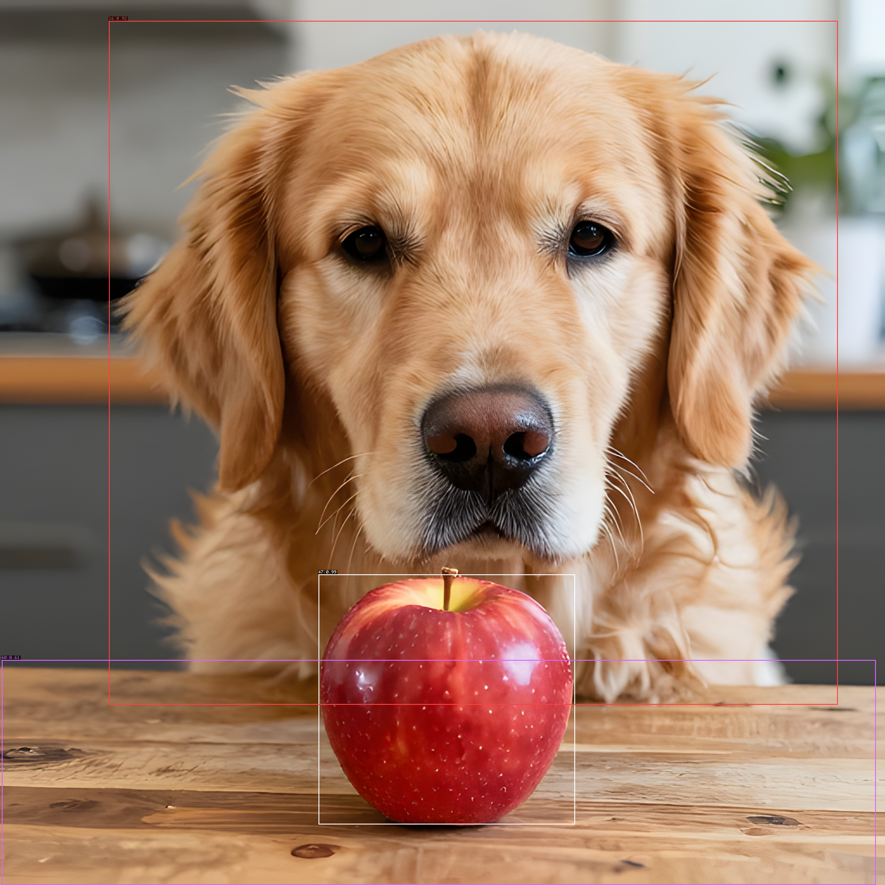
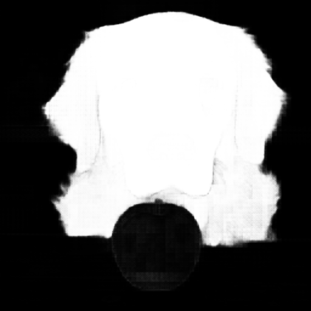
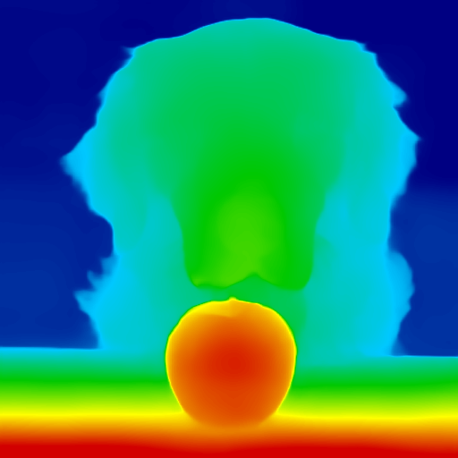

# BRaiN


Modern AI infrastructure is fragmented. Knowledge is spread across many frameworks. Nothing can be optimized all in one place. 

Training usually means Python and PyTorch. Production inference means another
runtime. Edge deployment means another toolchain. Browser inference means
WebGPU. Intel NPUs mean OpenVINO. Distributed execution adds another layer
again. Every new model arrives with its own assumptions, dependencies, code, and
serving path.

**BRaiN replaces that stack with one engine.**

It trains and runs models locally, in pure Rust, across GPUs, CPUs, Intel NPUs,
and WebGPU - without embedding Python, PyTorch, CUDA, or another deep-learning
framework into the runtime.

The same primitives, model definitions, execution graph, and interfaces are used
from training through deployment. GPU kernels are implemented directly,
backpropagation is verified independently with finite-difference gradient
checking, and models are exposed uniformly through CLI, HTTP, and D-Bus.

## What brain solves today

* **One runtime from training to serving** - train, fine-tune, evaluate, and serve without moving the model between unrelated frameworks.
* **One hardware abstraction** - run the same model code on GPUs, CPUs, Intel NPUs, or in the browser through WebGPU.
* **One serving stack** - local models behind OpenAI-, Anthropic-, and OpenRouter-compatible APIs, with paged KV cache and continuous batching.
* **Training without PyTorch** - forward pass, backward pass, optimizers, and GPU kernels implemented directly in brain.
* **One interface across model types** - language, vision, speech, image generation, forecasting, and other models.
* **Fine-tuning on your own data** - including LoRA (support pending for more models)
* **Multimodal workloads without separate runtimes** - detection, depth, segmentation, recognition, restoration, upscaling, image generation, speech recognition, TTS, and voice cloning.
* **Distributed execution built into the engine** - data parallelism, pipeline parallelism, and tensor-parallel primitives over the same transport abstraction whether workers are threads, local processes, or machines on a network.
* **Weight streaming** - brain implements a residency engine that can efficiently stream weights and allows concurrent on demand model serving of multiple models at the same time with eviction control.

The goal of brain is to make model training and inference easily accessible, to
make it run on absolutely anything, and to keep all knowledge in one place and
to keep optimizing it relentless so that it becomes an extremely efficient AI
workload runtime that scales across both accelerators and nodes.

## Quick start

```bash
make release                          # build the optimized ./target/release/brain
make test                             # full test suite
make gradcheck                        # backprop correctness gate (finite differences)
```

Every architecture is reachable through one grammar: `brain <verb>
<architecture>` and `brain <architecture> <verb>` are the same command. Every
line below is a real command, run for real, with its real output - a chained
demo where each model's output feeds the next one's input, so a passing chain
is also a cross-model correctness check: if the caption names the same object
the detector found, three independently-trained models just agreed on what's
actually in the image.

**Text generation** - no weights on disk yet, no flags beyond the prompt:

```bash
$ brain infer qwen3 --prompt "The capital of France is" --max-new 12   # auto-fetches Qwen/Qwen3-0.6B
The capital of France is Paris. The capital of Italy is Rome. The capital of
```

**Bidirectional text embedding** - a different architecture family (a non-causal encoder, not a decoder):

```bash
$ brain lfm2 embed --text "Brain trains and runs neural networks from scratch, in Rust."   # auto-fetches LiquidAI/LFM2.5-350M
embedding[1024] mean-pool head: [1.97, -1.367, 3.628, 0.754, 2.136, -1.704, 1.704, -1.871] …
```

**Image generation** - the one seed image every step below reads:

```bash
$ brain --device gpu s3dit text2image \
    --prompt "a golden retriever dog and a red apple on a wooden table, photorealistic, natural lighting" \
    --width 512 --height 512 --seed 7 --steps 8 --precision int8 \
    --out image=seed.png                                    # auto-fetches Tongyi-MAI/Z-Image-Turbo (~33 GB)
```


**Super-resolution, then object detection** on the upscaled result:

```bash
$ brain rrdbnet upscale --in image=seed.png --tile 128 --out image=upscaled.png   # auto-fetches schwgHao/RealESRGAN_x4plus
$ brain yolov8 detect --weights <ckpt> --image upscaled.png                       # auto-fetches Ultralytics/YOLOv8
[737.14,1328.68,1330.23,1907.12,0.9882,47]
[251.78,48.02,1938.25,1630.42,0.9171,16]
[4.37,1526.75,2025.50,2046.93,0.6109,60]
```



Three independent boxes, three correct classes: `47` (apple, 0.99), `16`
(dog, 0.92), `60` (dining table, 0.61) - YOLOv8n finding exactly what the
generation prompt asked for, at 4x the seed image's resolution.

**Promptable segmentation**:

```bash
$ brain sam2 segment --in image=seed.png --points "220,180" --labels "1" --out mask=dog-mask.png --json   # auto-fetches facebook/sam2.1-hiera-tiny
{"area":113765,"iou":0.9763,"object_score":21.10,...}
```



`dog-mask.png` is kept - it drives the inpainting step below.

**Monocular depth**, false-colored (near = red, far = blue):

```bash
$ brain zipdepth --image seed.ppm --weights zipdepth_base.pth --headless --view depth --colormap turbo --out depth.ppm
depth: 512x512, inference 137.6 ms (engine)
```



**Image + text → text**, two ways - a dedicated fast captioner and a general
VQA model, on the same image:

```bash
$ brain fastvlm caption --in image=seed.png --prompt "What is in this image? Answer in one sentence." --max_new 40   # auto-fetches apple/FastVLM-0.5B
A golden retriever with a red apple in front of it, both in sharp focus, with a blurred background.

$ brain qwen3vl generate --in image=seed.png --prompt "What is in this image? Answer in one sentence." --max_new 40   # auto-fetches Qwen/Qwen3-VL-4B-Instruct
A golden retriever is looking at a red apple on a wooden table.
```

**Masked inpainting** - invert sam2's own segmentation mask (above) so it reads
"regenerate everything *but* the dog", then let the dog anchor the composition
while the wood table, the apple, and the background all change together:

```bash
$ python3 -c "from PIL import Image, ImageOps; ImageOps.invert(Image.open('dog-mask.png').convert('L')).save('bg-mask.png')"
$ brain --device gpu s3dit inpaint --in image=seed.png --in mask=bg-mask.png \
    --prompt "a golden retriever dog sitting behind a slice of chocolate cake on a white marble kitchen countertop, bright natural daylight, blurred modern kitchen background, photorealistic" \
    --strength 1.0 --feather 0 --steps 8 --precision int8 \
    --out image=inpainted.png
```


A real segmentation mask driving inpainting, not a hand-picked rectangle: the
dog is the one thing sam2 marked, so it's the one thing this leaves alone.
`feather=0` is deliberate here, not the default 2-3: any positive feather
blends a few percent of the *original* pixels back in near the mask boundary
at every sampling step, and the apple used to sit right against the dog's
chin - so it kept reinforcing an apple-shaped ghost into the regenerated
cake regardless of step count. sam2's mask already follows the dog's real
silhouette, so a hard edge doesn't need softening to hide a straight line.

**Speech: text → speech → text → text**, a full TTS → ASR → LLM round trip,
through two independently-trained ASR models on the exact same audio:

```bash
$ brain qwen3tts synth --text "Brain trains and runs neural networks from scratch, in Rust." --out spoken.wav   # auto-fetches Qwen/Qwen3-TTS-12Hz-0.6B-Base
$ brain nemotronasr transcribe --in audio=spoken.wav --json                                                     # auto-fetches nvidia/nemotron-3.5-asr-streaming-0.6b
{"text":"Brain trains and runs neural networks from scratch in rust. ",...}
$ brain qwen3asr transcribe --in audio=spoken.wav --json                                                        # auto-fetches Qwen/Qwen3-ASR-1.7B
{"text":"Brain training.",...}
$ brain infer qwen3 --prompt "Brain trains and runs neural networks from scratch in rust." --max-new 24
Brain trains and runs neural networks from scratch in rust. This is a problem that is very common in the field of AI, and it is also a problem that is very difficult
```

**Document OCR** - a second round trip through a different modality (text →
rendered document image → text), the same self-verifying shape as the
speech round trip above:

```bash
$ brain deepseek2ocr generate --in image=doc.png --prompt "<|grounding|>Convert the document to markdown."   # auto-fetches ggml-org/DeepSeek-OCR-GGUF
Brain trains and runs neural networks from scratch, in Rust.
```

A word-for-word match of the sentence rendered into `doc.png` - real OCR on
a real (synthetically rendered) document image, not a toy string echo.

**LoRA fine-tuning**, on a synthetic dataset generated in-process (no
external data, ~200 steps):

```bash
$ brain data gen tts --out data/tts --n 4000 --seed 1337
$ brain qwen3tts finetune --base <ckpt>/talker.safetensors --data data/tts --out talker_lora.safetensors --steps 200
finetune done: loss 17.6053 -> 0.3237  saved -> talker_lora.safetensors
```

A real, measured loss descent from a rank-8 adapter, not a claim.

**Serving** - the same weights, behind a local OpenAI-compatible API:

```bash
$ brain serve --openai 8799 &
APIKEY openai sk-brain-...
$ curl http://127.0.0.1:8799/v1/chat/completions -H "Authorization: Bearer $APIKEY" \
    -H 'Content-Type: application/json' \
    -d '{"model":"Qwen/Qwen3-0.6B","messages":[{"role":"user","content":"Say hello in exactly five words."}]}'
Hi, how are you?
```

Every one of these is reachable the same way once you point it at weights
(`brain caps <arch>` prints exactly what each action takes):

```bash
brain caps                                                  # every architecture + its actions
brain infer scrfd --in image=photo.ppm --json                # face detection (needs BRAIN_SCRFD_DIR)
brain infer glmdsa --weights F --prompt "..."                 # GLM-5.2 MoE decoder
brain zipdepth --image photo.ppm --weights zipdepth.pth       # monocular depth
```

## Model support

Every model `brain caps` reports, with what it does and where its full page
is. Toy architectures (`toymoe`, `toypid`, `toyseq2seq`, `toyautoencoder` --
brain's own tasks, no upstream reference) are excluded here; see
[`docs/models/index.md`](docs/models/index.md) for the complete catalog
including those.

| Model id | Domain | What it does |
|---|---|---|
| [`Qwen/Qwen3-0.6B`](docs/models/qwen3.md) | Text | dense decoder chat/tool-calling, paged continuous-batching serving |
| [`brain/qwen35moe`](docs/models/qwen35moe.md) | Text | Qwen3.5-35B-A3B hybrid GDN/GQA MoE decoder |
| [`gpt2`](docs/models/gpt2.md) | Text | nanoGPT-style baseline, from-scratch training reference |
| [`glmdsa`](docs/models/glmdsa.md) | Text | GLM-5.2 (MLA + sigmoid noaux_tc MoE + DSA) |
| [`LiquidAI/LFM2.5-350M`](docs/models/lfm2.md) | Text | bidirectional encoder, fill-mask + embeddings, 8k context |
| [`qwen3omnimoe`](docs/models/qwen3omnimoe/readme.md) | Multimodal | text/audio/image/video in, text + speech out (Thinker+Talker+Code2Wav) |
| [`brain/qwen3vl`](docs/models/qwen3vl.md) | Multimodal | general image + text -> text |
| [`brain/fastvlm`](docs/models/fastvlm.md) | Multimodal | dedicated fast image captioning |
| [`deepseek-ai/DeepSeek-OCR`](docs/models/deepseek2ocr.md) | Multimodal | document image -> text/markdown |
| [`brain/nemotronasr`](docs/models/nemotronasr.md) | Audio | streaming speech-to-text (FastConformer + RNN-T) |
| [`brain/qwen3asr`](docs/models/qwen3asr.md) | Audio | offline speech-to-text |
| [`brain/qwen3tts`](docs/models/qwen3tts.md) | Audio | voice cloning / text-to-speech (Talker + MTP + codec) |
| [`Ultralytics/YOLOv8`](docs/models/yolov8/readme.md) | Vision | from-scratch anchor-free object detection |
| [`brain/zipdepth`](docs/models/zipdepth.md) | Vision | monocular depth (pure-conv, realtime webcam) |
| [`brain/sam2`](docs/models/sam2.md) | Vision | promptable segmentation |
| [`brain/scrfd`](docs/models/scrfd.md) | Vision | face detection (boxes, scores, 5-point landmarks) |
| [`brain/arcface`](docs/models/arcface.md) | Vision | face identity embedding (512-d, cosine-ready) |
| [`brain/clip`](docs/models/clip.md) | Vision | text/image embeddings |
| [`Tongyi-MAI/Z-Image-Turbo`](docs/models/s3dit.md) | Image | text-to-image diffusion (S3-DiT) |
| [`brain/flux2-klein`](docs/models/flux2.md) | Image | text-to-image + editing (MMDiT) |
| [`brain/codeformer`](docs/models/codeformer.md) | Image | blind face restoration |
| [`brain/rrdbnet`](docs/models/rrdbnet.md) | Image | super-resolution |
| [`brain/vqgan`](docs/models/vqgan.md) | Image | VQ autoencoder (CodeFormer's codebook) |
| [`worldmirror2`](docs/models/worldmirror2.md) | 3D | multi-view images -> 3D Gaussian Splatting scene |
| [`splat`](docs/models/splat.md) | 3D | 3D Gaussian Splatting viewer/renderer |
| [`brain/chronos2`](docs/models/chronos2.md) | Forecasting | probabilistic time-series forecasting |
| [`brain/fincast`](docs/models/fincast.md) | Forecasting | patched decoder + sparse MoE forecasting |
| [`brain/kronos`](docs/models/kronos.md) | Forecasting | OHLCV candlestick forecasting |
| [`diamond`](docs/models/diamond.md) | World models | playable, action-conditioned Atari-100k simulation |
| [`brain/imgpipe`](docs/models/imgpipe.md) | Vision | composable image-processing pipeline (no HTTP endpoint) |

## Where to go next

| | |
|---|---|
| **Full documentation** | [`docs/readme.md`](docs/readme.md) |
| Install & build | [`docs/introduction/install.md`](docs/introduction/install.md) |
| The `brain` command line | [`docs/using/cli.md`](docs/using/cli.md) |
| Every `BRAIN_*` environment variable | [`docs/using/configuration.md`](docs/using/configuration.md) |
| Model catalog | [`docs/models/index.md`](docs/models/index.md) |
| Scaling across GPUs | [`docs/scaling/overview.md`](docs/scaling/overview.md) |
| Performance | [`docs/performance/overview.md`](docs/performance/overview.md) |
| Kernel catalogue (generated) | [`docs/reference/kernels.md`](docs/reference/kernels.md) |
| Contributing to brain | [`AGENTS.md`](AGENTS.md) |

## License

Apache-2.0 - see [`LICENSE`](LICENSE).
