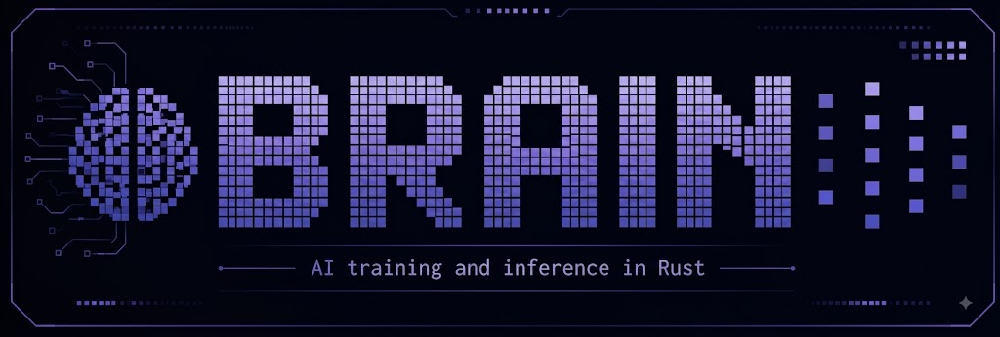

# brain



**Local AI training and inference, in pure Rust.** brain is a self-contained
engine — hand-written GPU compute kernels instead of a bundled deep-learning
framework, no Python required to build or run it, and backprop correctness
gated by an in-repo gradient checker instead of a PyTorch reference. One
engine runs identically on your GPU, your CPU, an Intel NPU, or inside a web
browser via WebGPU.

## What brain solves today

- **Run an LLM locally**, served behind an OpenAI/Anthropic/OpenRouter-compatible
  API, with paged-KV continuous-batching serving.
- **Train a model from scratch on the GPU** — forward, backward, and AdamW, all
  hand-written WGSL, correctness-checked by finite differences on every
  backend.
- **LoRA fine-tune** a language model or a forecaster on your own data.
- **See and edit images** — detection, depth, segmentation, face recognition,
  restoration, upscaling, and text-to-image generation.
- **Speech in and out** — voice cloning, text-to-speech, streaming and offline
  speech-to-text.
- **Forecast time series**, including your own OHLCV market data.
- **Scale across GPUs** — data-parallel, pipeline-parallel, and (for the
  primitives) tensor-parallel training, over a transport that works the same
  whether your workers are threads on one box or processes on a network.

Every model is reachable the same way — CLI, HTTP, and D-Bus — through one
uniform interface (`brain caps` / `brain do`), not a bespoke integration per
model.

## Quick start

```bash
make release                          # build the optimized ./target/release/brain
make test                             # full test suite
make gradcheck                        # backprop correctness gate (finite differences)

# Train + evaluate the GPT baseline end to end:
make data/calculator                  # generate a dataset
make train/gpt/calculator             # -> out/gpt-calculator.safetensors
make eval/gpt/calculator              # validation perplexity + task exact-match
```

See [`docs/introduction/quickstart.md`](docs/introduction/quickstart.md) for a
walkthrough, including running a real LLM behind a local API in one command.

## Supported models

A sample of what's covered — the full matrix (every model, what it supports,
and its own page) is [`docs/models/index.md`](docs/models/index.md).

| Task | Examples |
|---|---|
| Text | Qwen3 chat/tool-calling, a mixture-of-experts decoder, a nanoGPT-style baseline |
| Vision | YOLOv8-style detection, monocular depth, promptable segmentation, face recognition |
| Image generation & editing | Text-to-image diffusion, face restoration, super-resolution |
| Speech | Voice cloning / TTS, streaming and offline speech-to-text |
| Forecasting | Probabilistic time-series and OHLCV forecasters, with LoRA fine-tuning |
| 3D | Multi-view reconstruction, 3D Gaussian Splatting |
| World models | Playable, action-conditioned video simulation |

## Where to go next

| | |
|---|---|
| **Full documentation** | [`docs/readme.md`](docs/readme.md) |
| Install & build | [`docs/introduction/install.md`](docs/introduction/install.md) |
| The `brain` command line | [`docs/using/cli.md`](docs/using/cli.md) |
| Every `BRAIN_*` environment variable | [`docs/using/configuration.md`](docs/using/configuration.md) |
| Model catalog | [`docs/models/index.md`](docs/models/index.md) |
| Scaling across GPUs | [`docs/scaling/overview.md`](docs/scaling/overview.md) |
| Performance | [`docs/performance/overview.md`](docs/performance/overview.md) |
| Kernel catalogue (generated) | [`docs/reference/kernels.md`](docs/reference/kernels.md) |
| Contributing to brain | [`AGENTS.md`](AGENTS.md) |

## License

Apache-2.0 — see [`LICENSE`](LICENSE).
