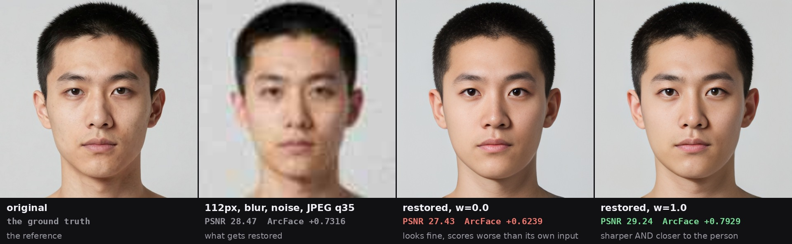
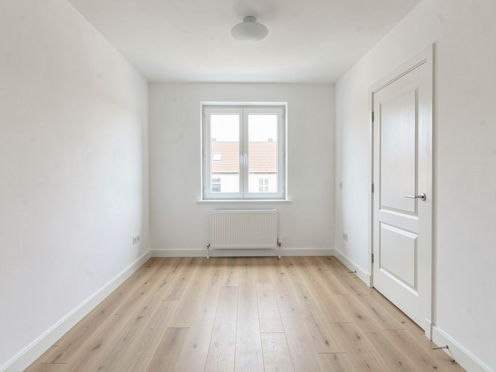
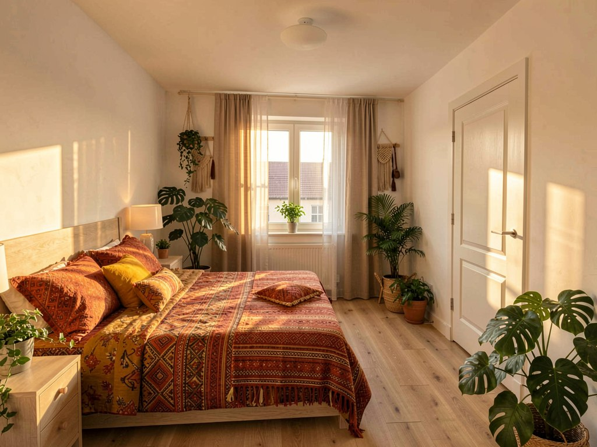
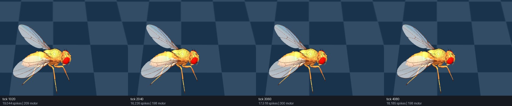
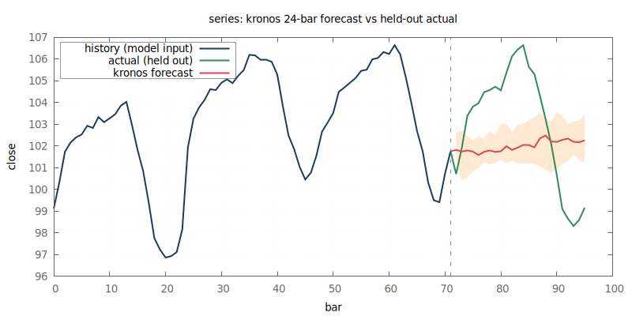

# BRaiN


**Built by [Swedish Embedded AB](https://swedishembedded.com)** - we put AI on
hardware that ships. [Hire us](#who-builds-brain).

**brain trains and runs neural networks from scratch, in pure Rust, on hardware
you already own.**

One binary carries **40+ model architectures** - decoder LLMs, vision, speech,
image and video generation, OCR, forecasting, 3D reconstruction and playable
world models - on top of **489 hand-written WGSL compute kernels** and no deep
learning framework at all. There is no PyTorch, no Python, no CUDA toolkit and
no ONNX runtime in the build path or the run path. The same kernel source
executes on GPUs (Vulkan, Metal, DX12), on a CPU with no accelerator, and in a
browser tab through WebGPU.

That is the whole point: **one engine from `make build` to a served endpoint.**
Train a model from scratch, import a 27B checkpoint, quantize it to INT8, shard
it across two cards, fine-tune a LoRA on it, and serve it behind an
OpenAI-compatible API - without the model leaving this runtime or touching a
second toolchain at any step.

[](https://www.youtube.com/watch?v=6N3J8Xj0HkY)

## Why it exists

Modern AI infrastructure is fragmented, and the fragmentation is where the cost
is. Training means Python and PyTorch. Production inference means a different
runtime. Edge deployment means another toolchain, browser inference means
WebGPU, Intel NPUs mean OpenVINO, and distributed execution adds a layer on top
of all of it. Every new model arrives with its own assumptions, dependencies and
serving path, and nothing can be optimized in one place because nothing lives in
one place.

brain replaces that stack with a single engine. The same primitives, model
definitions, execution graph and interfaces carry a model from training through
deployment. GPU kernels are written directly rather than generated by a
framework, backpropagation is verified independently with finite-difference
gradient checking, and every model is exposed the same way through a CLI, an
HTTP API and D-Bus.

## What brain does

| | Models | What you can do with it |
|---|---|---|
| **Text** | Qwen3, Qwen3.5-35B-A3B, Qwen3.8-27B, GLM-5.2, GPT, LFM2.5 | chat, tool calls, embeddings, fill-mask; paged-KV continuous-batching serving; train from scratch; LoRA |
| **Vision** | YOLOv8, SAM 2.1, ZipDepth, SCRFD, ArcFace, CLIP, Florence-2 | detection, promptable segmentation and video tracking, monocular depth, face detection/recognition, grounding, embeddings |
| **Vision-language** | Qwen3-VL, FastVLM, Moondream 3, DeepSeek-OCR 1 & 2, Qwen3-Omni | image + text to text, document OCR to markdown, captioning, omni-modal assistants |
| **Image generation** | Z-Image, FLUX.2 Klein, FLUX.1/Kontext, SDXL, ControlNet, PuLID | text-to-image, reference editing, masked inpainting, control conditioning, identity conditioning, LoRA training |
| **Imaging** | CodeFormer, Real-ESRGAN, VQGAN, SUPIR, imgpipe | face restoration, 4x super-resolution, composed "change only X" pipelines |
| **Video** | Wan 2.1/2.2, LTX-2.5 | text-to-video to a playable mp4 in one command |
| **Speech & audio** | Qwen3-TTS, CosyVoice 2/3, Nemotron-3.5-ASR, Qwen3-ASR, MiniMax Music 3 | voice cloning, streaming and offline speech-to-text, music generation |
| **Forecasting** | Chronos-2, Kronos, FinCast, TimesFM-3 | probabilistic time-series and OHLCV forecasting, with a rolling-origin backtester |
| **3D** | WorldMirror-2, 3D Gaussian Splatting | photos to a navigable 3DGS scene; render, fly through, and optimize it |
| **World models** | DIAMOND, GenieRedux-G | playable, action-conditioned video simulation |
| **A digital animal** | [the fruit fly](docs/models/fly.md) | a 178,860-neuron *Drosophila* connectome run as a spiking network, driving a body in MuJoCo through its own motor neurons |

Every one of them is reached by the same grammar - `brain <architecture>
<verb>` and `brain <verb> <architecture>` are the same command - and every one
of them is servable over HTTP and D-Bus through the same capability interface.
The full catalog, with what each model supports and its own page, is
[`docs/models/index.md`](docs/models/index.md).

Underneath, the parts that make that possible are engine features in their own
right: INT8 and INT4 quantization, multi-GPU tensor/pipeline/data parallelism, a
residency engine that streams weights and keeps several models warm inside a
fixed memory budget, paged KV cache with continuous batching and speculative
decoding, and a cost model that prices a model before you run it.

## See it work

Every command below is real, and every image is that command's actual output.
The first few chain into each other on purpose: each model's output is the next
model's input, so a passing chain is also a cross-model agreement check.

Weights arrive on their own the first time a model is needed, or up front with
`brain pull`:

```bash
brain pull Qwen/Qwen3-0.6B
brain pull https://huggingface.co/Qwen/Qwen3-0.6B --brain-data-dir /mnt/models
```

### Text, with nothing on disk yet

```bash
$ brain infer qwen3 --prompt "The capital of France is" --max-new 12   # auto-fetches Qwen/Qwen3-0.6B
The capital of France is Paris. The capital of Italy is Rome. The capital of
```

### Generate an image, then take it apart

One seed image, then three independently-trained models reading it:

```bash
$ brain --device gpu s3dit text2image \
    --prompt "a golden retriever dog and a red apple on a wooden table, photorealistic, natural lighting" \
    --width 512 --height 512 --seed 7 --steps 8 --precision int8 \
    --out image=seed.png                                    # auto-fetches Tongyi-MAI/Z-Image-Turbo
```


```bash
$ brain yolov8 detect --weights <models>/Ultralytics/YOLOv8/model.brain.safetensors --image seed.ppm
[184.00,332.92,332.91,477.24,0.9928,47]
[64.09,12.94,470.45,408.79,0.9326,16]
[1.29,381.97,506.29,511.46,0.6724,60]
brain yolov8 detect: 3 detection(s) on 512x512
```

Three boxes, three correct classes: `47` (apple, 0.99), `16` (dog, 0.93), `60`
(dining table, 0.67) - a detector finding exactly what the generation prompt
asked for.


```bash
$ brain sam2 segment --in image=seed.png --points "220,180" --labels "1" \
    --out mask=dog-mask.png --json                          # auto-fetches facebook/sam2.1-hiera-tiny
{"area":113765,"iou":0.9763,"object_score":21.10,...}

$ brain zipdepth --image seed.ppm --weights <models>/zipdepth/zipdepth_base.pth \
    --headless --view depth --colormap turbo --out depth.ppm
depth: 512x512, inference 137.6 ms (engine)
```

| segmentation (sam2) | depth (zipdepth) |
|---|---|
|  |  |

### Edit only what a segmentation model selected

Invert sam2's own mask so it reads "regenerate everything *but* the dog", and
the dog anchors the composition while the table, the apple and the background
all change together:

```bash
$ brain --device gpu s3dit inpaint --in image=seed.png --in mask=bg-mask.png \
    --prompt "a golden retriever dog sitting behind a slice of chocolate cake on a white marble kitchen countertop, bright natural daylight, blurred modern kitchen background, photorealistic" \
    --strength 1.0 --feather 0 --steps 8 --precision int8 \
    --out image=inpainted.png
```


A real segmentation mask driving a real edit, not a hand-picked rectangle: the
dog is the one thing sam2 marked, so it is the one thing this leaves alone.

### Three models checking each other's work

A face pipeline where the last model audits the middle one. SCRFD finds the
face and its five landmarks, a 4-DOF similarity warp onto those landmarks cuts
the aligned 512x512 crop CodeFormer expects, CodeFormer restores a degraded
copy of it, and ArcFace answers the question that decides whether the
restoration can be used at all: is this still the same person?

```bash
$ brain scrfd detect --in image=portrait.png --json
{"count":1,"faces":[{"bbox":[139.20,105.75,374.52,416.26],"kps":[[204.40,224.54],…],"score":0.858}],…}

$ brain codeformer restore_face --w 1.0 --in image=degraded.png --out image=restored.png
$ brain arcface embed --align false --in image=restored.png --out embedding=restored.bin
```



The input is a face destroyed past legibility, and what comes back is sharp and
is the same man. Both measures agree rather than only the eye: against the
original, PSNR rises 28.47 -> 29.24 dB and the ArcFace cosine rises
+0.7316 -> +0.7929. The restoration is closer to the truth than the thing it
was handed, on a pixel measure *and* on an identity measure.

`w` is what decides that, and it is not a quality slider - it sets how much of
the output comes from the input pixels versus CodeFormer's learned prior. The
`w=0.0` panel looks perfectly good and is worse than its own input on both
counts. Nothing in the picture tells you that; the third model does. Which is
the whole point of running three: the one that would fool you is not the one
scoring the result.

The full grid, four damage levels by four `w` values on both measures -
including the damage threshold below which restoring at all makes things
worse - is in [`docs/models/codeformer.md`](docs/models/codeformer.md).

Every pixel in that figure came out of this repo: the original is `brain s3dit
text2image` output, not a photograph of a real person.

### Virtual staging with a LoRA you trained

Two commands: generate an empty room, then furnish it while keeping the room.

```bash
$ brain --device gpu flux2 generate --variant klein-9b --precision int8 \
    --prompt "Photorealistic professional real estate photograph of an empty unfurnished bedroom. Bare white walls, plain light oak floorboards, a single large window, a radiator under the window, a white panelled door. Completely empty room, no furniture, no rugs, no curtains." \
    --width 1024 --height 768 --seed 20260827 --out empty-room.png
```



```bash
$ brain --device gpu flux2 generate --variant klein-9b --precision int8 \
    --ref empty-room.png --strength 1.0 --ref-size 768 \
    --adapter boho.brain --lora-scale 1.0 \
    --prompt "a bohemian style room, photorealistic interior photograph, warm natural daylight, layered textiles and patterned fabrics, rattan and natural wood, plants, eclectic decor, professional real estate photography" \
    --width 1024 --height 768 --seed 7 --out staged-room.png
```



The same window with the same rooftops through it, the same radiator beneath
it, the same panelled door and handle, the same floor, the same camera - and a
furnished room. `--strength 1.0` is what makes that work, and it is not an
intensity knob: it decides *where the denoise starts*. At `1.0` the reference
stops being the initial latent and becomes conditioning only, so the model
*looks at* the room instead of starting from it. Below `1.0` the denoise starts
from pixels that say "empty room", and an empty room is what you get back.
[`docs/models/flux2.md`](docs/models/flux2.md) shows the full ladder, and
`--mask` is the spatial dial for preserving specific architecture.

The adapter is brain's own: `brain flux2 finetune <captioned-image-dir> --out
boho.brain` trains it, and third-party ai-toolkit/ComfyUI LoRA and LoKr
`.safetensors` files load too.

### Text to video

```bash
$ brain --device gpu wan t2v \
    --prompt "a golden retriever running along a sandy beach at sunset, waves in the background, cinematic" \
    --frames 9 --width 416 --height 240 --steps 20 --seed 7 \
    --output-path wan.mp4                                   # auto-fetches Wan-AI/Wan2.1-T2V-1.3B
wan: wrote wan.mp4 (416x240, 9 frames at 16 fps)
```


Every second frame, side by side. The subject crosses the frame while the sea
and sky stay put - the thing a video model has to do and an image model cannot.
[`docs/models/wan.md`](docs/models/wan.md) has the measured cost breakdown.

### Speech, round-tripped through two ASR models

```bash
$ brain qwen3tts synth --text "Brain trains and runs neural networks from scratch, in Rust." --out spoken.wav
$ brain nemotronasr transcribe --in audio=spoken.wav --json
{"text":"Brain trains and runs neural networks from scratch in rust. ",...}
$ brain qwen3asr transcribe --in audio=spoken.wav --json
{"text":"Brain training.",...}
```

Text to speech and back, through two independently-trained recognizers on the
same audio. The offline model's weaker result on this clip is shown as it came
out rather than dropped.

### Document OCR

```bash
$ brain deepseek2ocr generate --in image=doc.png --prompt "<|grounding|>Convert the document to markdown."
Brain trains and runs neural networks from scratch, in Rust.
```

A word-for-word match of the sentence rendered into `doc.png`.

### A connectome, running

Not a checkpoint port. A real *Drosophila* nervous system, reconstructed from
electron microscopy by other people's published work, executed as a spiking
network on the GPU and driving a body in MuJoCo through the animal's own motor
neurons:

```bash
$ make samples/fly/interactive/run ARGS="--connectome $BRAIN_CONNECTOME_DIR --body $BRAIN_FLYBODY_FRUITFLY_XML --frames 240"
23665 neurons, 330 motor neurons attached to 44 actuators, 407 unmapped - loaded in 7.9 s
frame 240 tick 4080: drive 1.50 | 18185 spikes (198 motor) | 10.7 BL/s now
```



The wiring is the model; the parameters that make it *function* exist in no
file and have to be found in a body, against consequences. So what gets gated
at the end is a behaviour rather than a tensor - and
[`docs/models/fly.md`](docs/models/fly.md) says plainly which behaviours are
there and which are not. "Moves its legs" is done. "Walks" is not.

### Forecasting, scored against held-out truth

```bash
$ brain forecast predict --csv crates/kronos/tests/data/synthetic_hourly.csv \
    --horizon 6 --samples 16 --origins 16 --gnuplot kronos-forecast.png
kronos forecast: 506 bars of context -> 6 held-out bars x 16 rolling origins
  close, vs held-out truth       mean MAE       CRPS    pinball
  kronos                           0.5331     0.4139     0.1900
  persistence (last close)         0.5062     0.5062     0.2531
  seasonal naive (24 bars)         1.1005     1.1005     0.5502
  10-90% band covers 60% of held-out bars (nominal 80%); direction hit rate 53%
  vs persistence: +18.2% CRPS reduction, better at 10/16 origins
```



Scored against naive baselines, with the calibration miss (60% coverage at a
nominal 80% band) reported rather than hidden. See
[`docs/models/kronos.md`](docs/models/kronos.md).

### Serving

```bash
$ brain serve --openai 8799 &
APIKEY openai sk-brain-...
$ curl http://127.0.0.1:8799/v1/chat/completions -H "Authorization: Bearer $APIKEY" \
    -H 'Content-Type: application/json' \
    -d '{"model":"Qwen/Qwen3-0.6B","messages":[{"role":"user","content":"Say hello in exactly five words."}]}'
```

The same weights, behind a local OpenAI-compatible API - and the same models
over Anthropic- and OpenRouter-compatible endpoints, D-Bus, or the Rust SDK.

`braintop` shows what that server is actually doing. After four concurrent
requests to one model:

```console
$ braintop --cli | grep -E '^executor\.|resident=true'
model.Qwen/Qwen3-0.6B.resident=true
executor.builds=1      executor.batches=2     executor.jobs=5
executor.queue_peak=4  executor.max_batch=4   executor.evictions=0
```

Five jobs, a queue that reached four, served in two batches - continuous
batching rather than five sequential passes, with the model built once and
nothing evicted to make room. See
[`docs/using/monitoring.md`](docs/using/monitoring.md).

## Install and first run

```bash
make build/release                    # build the optimized ./target/release/brain
make test                             # full test suite
make gradcheck                        # backprop correctness gate (finite differences)
```

```bash
brain caps                            # every architecture and its actions
brain devices                         # what hardware brain found, and what --device resolves to
brain models list                     # what is on disk, and what it costs to run
```

Full instructions are in [`docs/introduction/install.md`](docs/introduction/install.md),
and [`docs/introduction/quickstart.md`](docs/introduction/quickstart.md) trains a
model from scratch and serves a real LLM in about five minutes.

## How you know it works

A framework that writes its own kernels has to prove they are right, and brain
has no PyTorch to diff against. So:

- **Backpropagation is gated by finite differences.** 78 gradient-check entry
  points (`make gradcheck`) compare every analytic WGSL gradient against a
  numerical one, on both the CPU and GPU backends - because a
  workgroup-barrier reduction can return all-zero gradients on one backend and
  correct ones on the other.
- **Imported models are parity-gated stage by stage** against goldens dumped
  from the reference implementation, not eyeballed. Most ports land at cosine
  `1.000000000` per stage, and the number each one reached lives in the test
  that asserts it.
- **Backends are gated against each other.** `make parity` checks CPU ==
  Vulkan == NPU; one implementation of each op either runs correctly everywhere
  or it is a bug.
- **The kernel catalogue is generated from the kernels themselves**
  ([`docs/reference/kernels.md`](docs/reference/kernels.md)), and the build
  fails when a kernel's declared properties contradict its code.
- **Limits are written down.** Where a model is forward-only, unvalidated at
  full scale, or not yet servable, its page says so in the same table as what
  it does support.

## Documentation

| | |
|---|---|
| **Full documentation** | [`docs/readme.md`](docs/readme.md) |
| What brain is, and the portability story | [`docs/introduction/what-is-brain.md`](docs/introduction/what-is-brain.md) |
| Install and build | [`docs/introduction/install.md`](docs/introduction/install.md) |
| Quickstart | [`docs/introduction/quickstart.md`](docs/introduction/quickstart.md) |
| Model catalog | [`docs/models/index.md`](docs/models/index.md) |
| The `brain` command line | [`docs/using/cli.md`](docs/using/cli.md) |
| Serving, HTTP and D-Bus APIs | [`docs/using/serving.md`](docs/using/serving.md) |
| The Rust SDK | [`docs/using/sdk.md`](docs/using/sdk.md) |
| Every `BRAIN_*` environment variable | [`docs/using/configuration.md`](docs/using/configuration.md) |
| Fine-tuning with LoRA | [`docs/training/lora.md`](docs/training/lora.md) |
| Scaling across GPUs | [`docs/scaling/overview.md`](docs/scaling/overview.md) |
| Performance and benchmarking | [`docs/performance/overview.md`](docs/performance/overview.md) |
| Kernel catalogue (generated) | [`docs/reference/kernels.md`](docs/reference/kernels.md) |
| Contributing to brain | [`AGENTS.md`](AGENTS.md) |

## Who builds brain

brain is built by **[Swedish Embedded AB](https://swedishembedded.com)**.

We build AI that runs on hardware that ships: on the GPU you already have, on a
CPU with no GPU at all, on an Intel NPU, on a board in the field, or in a
browser tab. Everything in this repository is that work done in the open - the
WGSL kernels, the finite-difference gradient checker that gates every backward
pass, the residency engine that keeps models inside a fixed memory budget, and
the serving stack that puts them behind an API.

Every capability below is implemented here, in the open, and held to tests you
can run yourself. Read the code before you talk to us. If your team needs one of
these, you can hire us to do it:

* **Running models on the hardware you have** - GPUs, CPUs with no accelerator,
  Intel NPUs, embedded Linux boards, WebGPU in the browser. One model, one
  implementation, every target.
* **Getting a large model to fit** - quantization, weight streaming, tiled and
  memory-bounded inference, multi-GPU sharding. The difference between "needs a
  datacenter" and "runs on the card in the machine".
* **Porting a model from a paper or a PyTorch checkpoint** to a dependency-free
  runtime, gated by real numerical parity against the reference rather than by
  hope.
* **Writing and optimizing GPU compute kernels** - and proving the result is
  still correct afterwards.
* **Production inference systems** - concurrent serving, paged KV cache,
  continuous batching, model residency and scheduling across accelerators.
* **Embedded and real-time firmware** alongside the AI, which is where this
  company started and still spends much of its time.

Send an email to **info@swedishembedded.com** and tell us what you are trying
to ship.

## License

Apache-2.0 - see [`LICENSE`](LICENSE). Individual model weights carry their own
upstream licenses; see
[`docs/compliance/third-party-models.md`](docs/compliance/third-party-models.md).

Copyright (c) 2026 Swedish Embedded AB.
