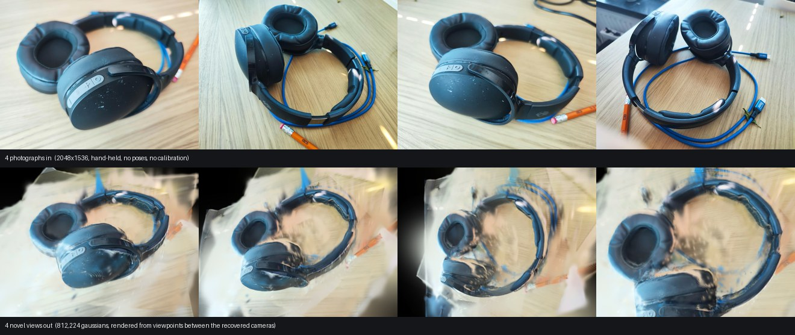

# WorldMirror-2 (multi-view 3D reconstruction)

Feed it several photos of a scene or object from different angles and it
reconstructs a navigable 3D scene - a Gaussian Splatting point cloud, plus
per-frame depth, normal, and confidence maps and recovered camera poses.
Reach for it when you have a handful of photos and want a 3D reconstruction
without running a full structure-from-motion + optimization pipeline
yourself; for rendering or further optimizing the resulting scene, see the
[splat](splat.md) page.

## Support

| Capability | Supported |
|---|---|
| Inference             | [x] |
| Training from scratch | [ ] |
| CLI (`brain <arch> <action>`)       | [ ] (has its own `brain worldmirror2 …` subcommand instead - see "Running it" below) |
| HTTP API               | [ ] `reconstruct` takes a REQUIRED `images` input blob, so it is not a text-to-image/chat action |
| D-Bus                  | [x] `reconstruct` (one-shot) |
| Batched serving        | [ ] |

## Getting the weights

There's no auto-fetched model id - import a released WorldMirror-2
checkpoint (a `.safetensors` file or a Hugging Face-style directory) into
brain's own format once:

```bash
brain worldmirror2 import <model.safetensors|hf_dir> --out out/mirror.safetensors
```

## Running it

```bash
# Reconstruct a scene from a folder of photos
brain worldmirror2 infer --weights out/mirror.safetensors --images photos/ --maps

# Fly through the result (WASD + mouse)
brain splat view out/mirror/scene.ply

# Or do both in one step: reconstruct, then open the interactive viewer
brain worldmirror2 demo --weights out/mirror.safetensors --images photos/
```

## What it produces

Four hand-held photographs of one object, with no poses, no calibration and no
structure-from-motion step, and four rendered views from camera positions
**between** the ones it recovered - viewpoints no photograph was taken from:



```console
$ brain worldmirror2 infer --weights mirror.safetensors --images views/ --maps --out scene
running WorldMirror-2 on 4 frame(s) at 518x392 ...
forward + assembly: 99.2s, 812224 gaussians
wrote scene/scene.ply (812224 gaussians) + scene/cameras.json

$ brain splat render scene/scene.ply --width 640 --height 480 --eye 0.53,-0.28,0.12 --target 0.02,-0.03,1.02 --out view.ppm
scene/scene.ply: 812224 gaussians -> view.ppm (640x480, tiled, 1496463 isects, 195 ms)
```

One feed-forward pass: no per-scene optimisation, no iterative refinement. The
cost of that is visible and worth stating - the reconstruction is sharp where
the four cameras saw the object and smears where they did not, and the desk
plane degrades quickly as the viewpoint leaves the volume those four span. A
feed-forward model interpolates between the views it was given; it does not
invent the ones it was not. For a scene you want to hold up to arbitrary
viewpoints, optimise it afterwards with [`splat fit`](splat.md).

## Options

`--images` takes either a directory of P6 PPM photos or a comma-separated
list; any aspect ratio is fine - non-square inputs are resized and cropped
automatically. `infer` writes `scene.ply` (the Gaussian scene) and
`cameras.json` (the recovered camera for each input photo) into `--out`
(default `out/mirror/`); `--maps` additionally writes a per-frame depth and
normal-map PPM for inspection.

## Options

| Flag | Effect |
|---|---|
| `--out DIR` | output directory for `infer` (default `out/mirror`) |
| `--ply <path>` | write the scene to a specific `.ply` path instead |
| `--maps` | also write per-frame depth/normal PPMs |
| `--min-opacity X` | drop gaussians below this opacity when assembling the scene (default `0.01`) |
| `--max-depth X` | drop gaussians beyond this depth (default: no limit) |
| `--prune VOXEL` | voxel-merge duplicate gaussians across overlapping views - try `0.002` for multi-view scenes |
| `--frames N` (`demo`) | cap the interactive viewer to N frames, for scripted/headless runs |

`brain worldmirror2 export-npu` exports individual model stages as ONNX for
running on the Intel NPU or CPU via OpenVINO - an advanced path for NPU
deployment rather than everyday use.

## Serving (D-Bus)

Model id: `brain/worldmirror2`. `BRAIN_WORLDMIRROR2_WEIGHTS` names the
imported checkpoint - a machine-side setting, not a per-request param (a
remote caller cannot answer "where is the checkpoint on THIS machine").

```bash
brain caps brain/worldmirror2
```

`reconstruct` (one-shot): takes `images` (N unposed frames, concatenated
interleaved-HWC f32 RGB - the same video convention every other video input
in this repo uses; every frame shares one `(w,h)`, which must also be a
multiple of the model's 14px patch grid) plus `min_opacity`/`max_depth`/
`prune_voxel`/`maps`, mirroring `brain worldmirror2 infer`'s own flags exactly.
Returns `scene` (the reconstructed Gaussian scene, Inria-layout binary PLY)
and `cameras` (the per-frame cameras WorldMirror-2 predicted, the same JSON
shape `cameras.json` uses); `maps` additionally returns a per-frame depth-map
video when requested. See
[`samples/python/vision/worldmirror2-reconstruct/worldmirror2_reconstruct.py`](../../samples/python/vision/worldmirror2-reconstruct/worldmirror2_reconstruct.py).

One resident instance serves every request shape: the model is
shape-adaptive internally (it rebuilds its own per-shape buffers on demand,
keeping the ~5GB checkpoint resident across a shape change), so the
scheduler keys the instance on the checkpoint alone, never on
frames/width/height. The one honest cost: only one shape's buffers are
cached at a time, so a workload that keeps ALTERNATING between two request
shapes on this one instance pays a full rebuild on every call - a latency
cost, not a correctness bug.

## Hardware and limits

This is reconstruction only - there's no training or fine-tuning verb for
this model. Camera or depth prompts (guiding the reconstruction with known
poses) aren't exposed on the CLI yet; every run starts from images alone.
There's no built-in sky-segmentation filter - use `--min-opacity` /
`--max-depth` to prune sky and background artifacts from the reconstructed
scene. The released WorldMirror-2 weights are under Tencent's community
license, which excludes the EU - treat an imported checkpoint as
reference/research material rather than something to ship. brain's own
implementation is unencumbered; only the upstream weights carry that
restriction.
