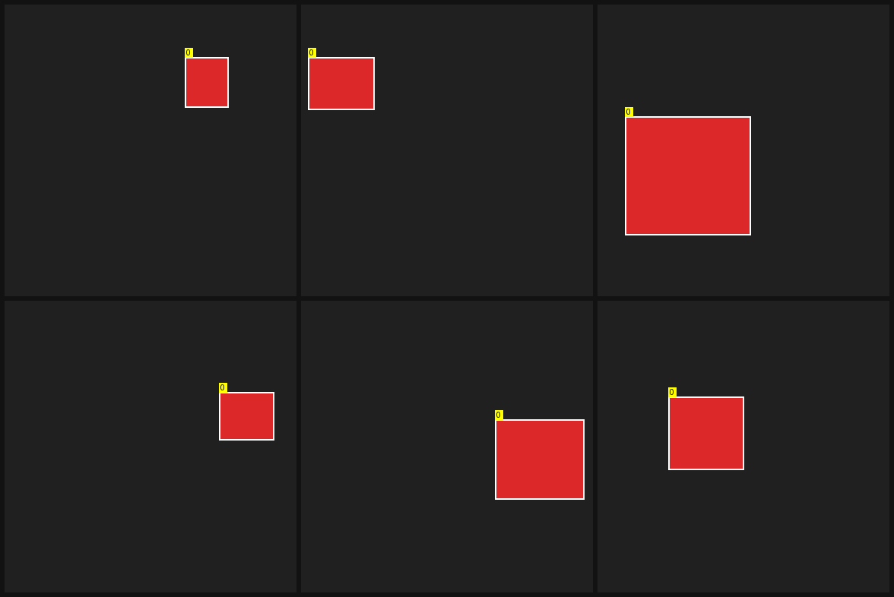
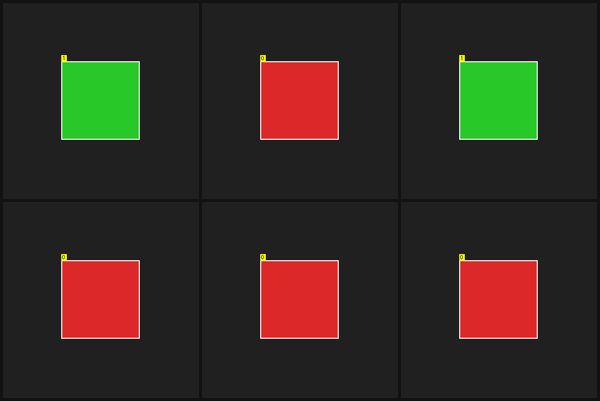
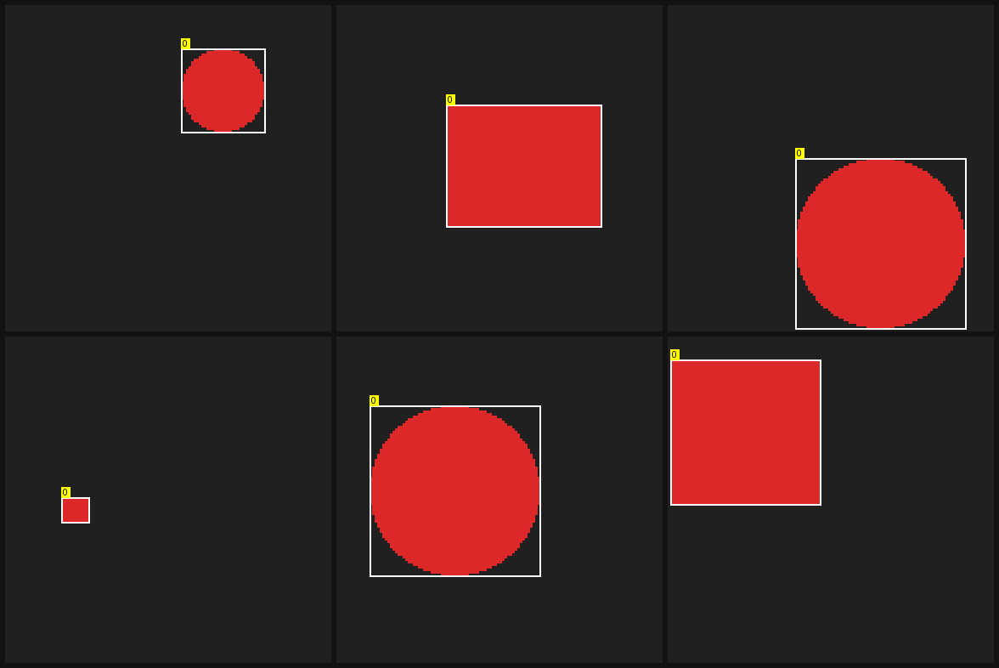
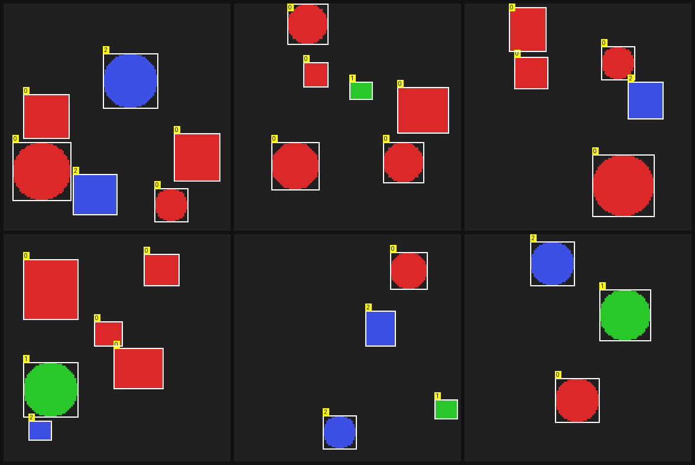
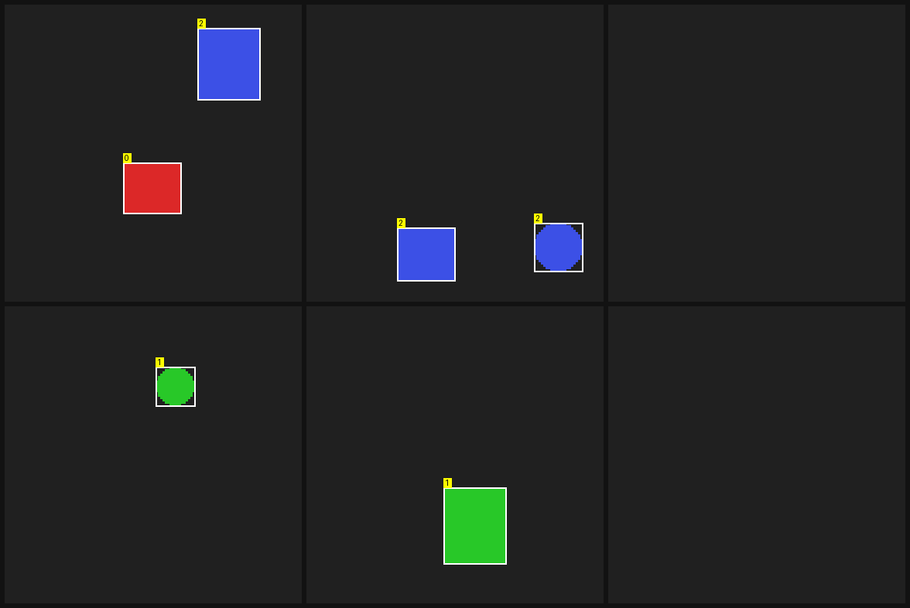
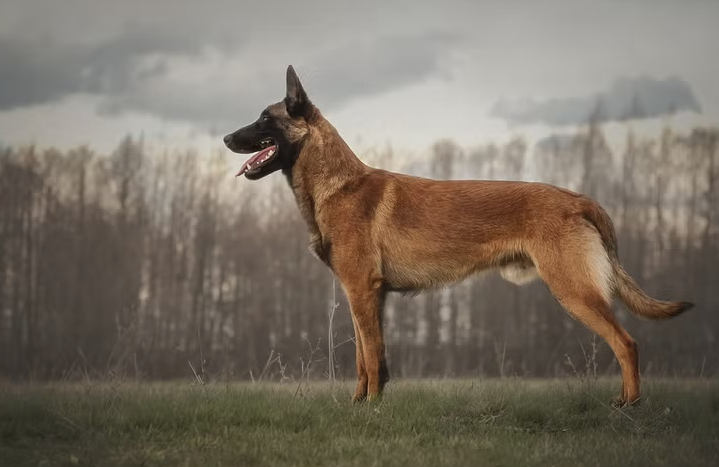
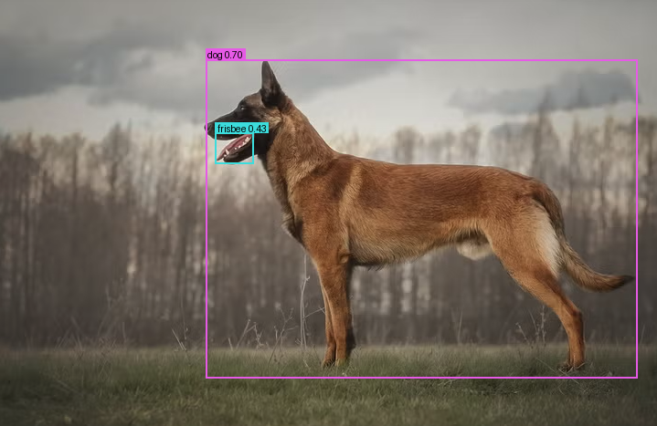

# The from-scratch YOLOv8 detector: training & inference, end to end

This document explains brain's anchor-free, single-stage object detector
(`crates/yolo`) in enough detail to fully reason about both **training** and
**inference**. Every formula, shape, and number below is derived from the actual
source — file paths and line ranges are cited inline. Where brain diverges from
canonical Ultralytics YOLOv8, the divergence is called out explicitly.

The detector runs entirely on brain's **CPU backend** (the WGSL kernels are
JIT-compiled to native code by the Cranelift backend; `Gpu::new_cpu`,
`crates/yolo/src/model.rs:262`). The *same* WGSL also runs on wgpu GPUs.

Contents:

1. [Overview](#1-overview)
2. [Inputs](#2-inputs)
3. [The network, layer by layer](#3-the-network-layer-by-layer)
4. [Outputs & decoding](#4-outputs--decoding)
5. [Training](#5-training)
6. [Inference pipeline](#6-inference-pipeline)
7. [The WGSL kernel layer](#7-the-wgsl-kernel-layer)
8. [Test suite (full spec)](#8-test-suite-full-spec)
9. [Worked example: real yolov8n on a photo](#9-worked-example-real-yolov8n-on-a-photo)
10. [How inference is invoked](#10-how-inference-is-invoked)

---

## 1. Overview

A YOLOv8 detector is an **anchor-free, single-stage** object detector
(`crates/yolo/src/config.rs:1-8`): a CSP backbone produces a feature pyramid at
three strides (8/16/32), a PAN-FPN neck fuses the levels, and a *decoupled* head
emits, per pyramid cell, `4*reg_max` DFL box-distribution logits + `nc` class
scores. There are no pre-defined anchor boxes: each feature cell is an "anchor
point" and the box is predicted as four directed distances from that point.

brain ships **one parametric graph** instantiated in two configurations
(`config.rs:66-123`):

| Config | Input | `nc` | `reg_max` | Strides | Params | Tensors | Use |
|---|---|---|---|---|---|---|---|
| `YoloConfig::tiny(nc)` | 128 | caller | 8 | 8/16/32 | small | — | CI training, gradchecks |
| `YoloConfig::yolov8n()` | 640 | 80 | 16 | 8/16/32 | **3,167,776** | **297** | pretrained inference |

Both flow through the *same* builder (`full_param_list`, `config.rs:130-205`;
`Yolo::new`, `model.rs:261-437`). The `yolov8n` config is **byte-compatible**
with the official Ultralytics `yolov8n.pt` graph (`width_mult 0.25`,
`depth_mult 0.33`, `max_channels 1024`): backbone out-channels
`[16,32,32,64,64,128,128,256,256,256]`, C2f bottleneck depths `[1,2,2,1]` for
stages 2/4/6/8, neck out-channels `[128,64,64,128,128,256]`, biased decoupled
head (`reg` hidden 64, `cls` hidden 80). The 3,167,776-parameter / 297-tensor
count is asserted by the name-map test (`tests/p8_names.rs`).

The `tiny` config keeps the exact same biased-head graph *shape* but with narrow
channels `[8,16,16,32,32,64,64,64,64,64]`, one bottleneck per C2f, `reg_max 8`,
128px input — small enough that the whole-net finite-difference gradient check
runs in CI without a GPU.

The config plugs into the architecture-agnostic `model::ModelConfig` seam
(`config.rs:307-331`): there is no token vocabulary, so `vocab()` carries the
object-class count `nc` and `block_size()` carries the square input resolution.

---

## 2. Inputs

### Image tensor

The model consumes an `(N, 3, H, W)` f32 tensor in **NCHW** layout, normalized to
`[0,1]` (`model.rs:269-270, 495-499`). For `tiny`, `H=W=128`; for `yolov8n`,
`H=W=640`.

### Letterbox

Real images of arbitrary size are mapped onto the square input by an
aspect-preserving resize + centre-pad ("letterbox"; `boxmath.rs:103-181`). The
forward map (original px → input px) is

$$ s = \min\!\left(\frac{\text{size}}{w_0},\ \frac{\text{size}}{h_0}\right),\quad
x_i = x_0\,s + \text{pad}_x,\quad y_i = y_0\,s + \text{pad}_y $$

with `new_w = round(w0·s)`, `new_h = round(h0·s)`, and the padding centred:
`pad_x = (size − new_w)/2`, `pad_y = (size − new_h)/2` (`boxmath.rs:124-131`).
The pad value is grey `114/255 ≈ 0.447` (the Ultralytics convention for
`/255`-normalized inputs; `infer.rs:91-92`). `letterbox_rgb` does the resize
(nearest-neighbour) + pad + HWC→CHW transpose in one pass (`boxmath.rs:161-181`).

### Ground-truth labels

A label is `GtBox { img, cls, cx, cy, w, h }` (`model.rs:48-56`): an image index,
an integer class id, and a box in **normalized centre-xywh** (each in `[0,1]` of
the image side). The assigner converts these to pixel `xyxy` via
`xywhn_to_xyxy` (`boxmath.rs:43-47`):

$$ x_1 = (c_x - w/2)\,\text{size},\ \ y_1 = (c_y - h/2)\,\text{size},\ \
x_2 = (c_x + w/2)\,\text{size},\ \ y_2 = (c_y + h/2)\,\text{size}. $$

### Synthetic training data

Training/eval uses a deterministic synthetic generator
(`crates/data/src/gen_detect.rs`): RGB scenes of filled rectangles and circles
(`imageproc` primitives) on a constant **dark-grey background** `RGB(32,32,32)`
(`gen_detect.rs:50`). Each class maps to a distinct saturated fill from a fixed
palette (`gen_detect.rs:54-61`): **0=red, 1=green, 2=blue**, 3=yellow,
4=magenta, 5=cyan. Class is therefore recoverable from colour alone. The GT box
is the *exact* painted pixel extent, stored normalized centre-xywh
(`gen_detect.rs:84-107, 298-316`).

Five presets (`gen_detect.rs:109-145`):

* **localization** — 1 shape, fixed class 0, varied position+size.
* **classification** — 1 centred medium shape, varied class/colour.
* **scale** — 1 shape, size drawn from small/medium/large buckets `{0.10, 0.25, 0.50}` of the min side.
* **multi_object** — 2–6 mixed-class shapes, heavy overlaps rejected.
* **background** — a `next_f64() < 0.30` fraction of images are **empty**, the rest carry 1–3 shapes (`gen_detect.rs:165-171`).

The grids below are 6-image samples at 128×128, 3 classes (0=red, 1=green,
2=blue). Each shape carries a **white GT box** and a yellow class-id tag.


*localization: one red (class-0) rectangle/circle per image at random position
and size — isolates box regression.*


*classification: a centred medium shape whose colour (red/green/blue) encodes the
class — isolates the cls branch.*


*scale: one class-0 shape sampled from small/medium/large buckets — isolates
multi-scale handling.*


*multi_object: 2–6 well-separated mixed-class shapes (overlaps rejected) — the
full detection task.*


*background: a mix that includes truly empty scenes (no GT) so the detector must
learn to emit no false positives on the bare background.*

---

## 3. The network, layer by layer

NCHW throughout. Every weight tensor and its name come from
`full_param_list` (`config.rs:130-205`) and the matching block builders
(`crates/yolo/src/blocks.rs`, `head.rs`).

### 3.1 The Conv-BN-SiLU atom

The fundamental unit is `Conv` = `conv2d` (bias-free) → BatchNorm → SiLU
(`blocks.rs:60-294`). Param names under prefix `P`: `P.conv.weight`
`[Cout,Cin,K,K]`, `P.bn.gamma [C]`, `P.bn.beta [C]`, `P.bn.run_mean [C]`,
`P.bn.run_var [C]` (`blocks.rs:165-177`). It supports K=3 (pad 1) / K=1 (pad 0)
and stride 1 or 2.

**conv2d** (`wgsl/conv2d.wgsl`), one thread per output element, implicit
zero-pad:

$$ y_{n,c_o,h_o,w_o} = \sum_{c_i}\sum_{k_h}\sum_{k_w}
x_{n,c_i,\,h_o s - p + k_h,\,w_o s - p + k_w}\cdot w_{c_o,c_i,k_h,k_w} $$

with output size $H_o = \lfloor (H + 2p - K)/s \rfloor + 1$ (taps outside
$[0,H)\times[0,W)$ are skipped — exactly the zero-pad contribution).

**BatchNorm.** Forward depends on a per-Conv mode flag (`blocks.rs:209-244`). In
**train mode** it uses *batch* statistics computed this forward pass; in **eval
mode** it uses the stored *running* statistics. Both kernels compute the same
affine (`wgsl/bn_train.wgsl`, `wgsl/bn_eval.wgsl`), with **eps = 1e-5**:

$$ y = \frac{x - \mu_c}{\sqrt{\sigma^2_c + 10^{-5}}}\,\gamma_c + \beta_c. $$

(The stats are passed as interleaved `mv[2c]=mean, mv[2c+1]=var` packed buffers
to stay within the ≤4-buffer kernel budget; `blocks.rs:199-263`.) During
*training*, if `update_running` is on, the running stats track the batch stats by
an EMA (`bn_running`, momentum **0.1** — chosen over PyTorch's 0.03 so the stats
become usable within a few hundred steps; `blocks.rs:121-126, 222-229`). This
EMA is *why* eval-mode inference works at all — see §5 and the p11 test.

**SiLU** (`wgsl/silu.wgsl`): $y = x\cdot\sigma(x) = x/(1+e^{-x})$.

### 3.2 Bottleneck

`Bottleneck` = `Conv(K3,s1)` → `Conv(K3,s1)`, with an optional residual `add2`
shortcut when `c_in == c_out && shortcut` (`blocks.rs:296-383`). Convs are named
`P.cv1`, `P.cv2`.

### 3.3 C2f (the CSP block)

`C2f` (`blocks.rs:385-608`): a 1×1 `cv1` expands `Cin → 2c` (where `c = Cout/2`),
the result is split into two `c`-channel halves `y0`/`y1`; `y1` runs through `n`
bottlenecks (each output *retained*); `[y0, y1, b1..bn]` is concatenated along the
channel axis to `(2+n)·c` channels; a final 1×1 `cv2` projects to `Cout`. This is
the brain reproduction of Ultralytics' C2f (cv1/cv2/m naming, `blocks.rs:36-39`).

### 3.4 SPPF (Spatial-Pyramid-Pooling-Fast)

`SPPF` (`blocks.rs:610-788`): a 1×1 `cv1` halves to `c = Cout/2`; three **chained
5×5 max-pools** (stride 1, pad 2, so spatial size is preserved; `wgsl/maxpool2d.wgsl`)
produce `m1=pool(x)`, `m2=pool(m1)`, `m3=pool(m2)`; `[x, m1, m2, m3]` (4·c
channels) is concatenated and a final 1×1 `cv2` projects to `Cout`. Chaining 5×5
pools gives effective receptive fields of 5/9/13 — pooling-pyramid context at the
deepest backbone stage, cheaply.

### 3.5 Backbone → P3/P4/P5

Ten stages (`config.rs:171-186`, `model.rs:278-293`); each Conv with stride 2
halves spatial resolution:

```
x → Conv(s2) → Conv(s2) → C2f → Conv(s2) → C2f(=P3,/8)
  → Conv(s2) → C2f(=P4,/16) → Conv(s2) → C2f → SPPF(=P5,/32)
```

The three pyramid features are: **P3 = stage 4** (stride 8), **P4 = stage 6**
(stride 16), **P5 = stage 9 / SPPF output** (stride 32).

### 3.6 PAN-FPN neck

The neck (`model.rs:295-313`; `config.rs:188-196`) fuses the pyramid top-down then
bottom-up. `up(·)` = 2× nearest upsample (`wgsl/upsample2.wgsl`:
`y[n,c,h,w]=x[n,c,h/2,w/2]`), `down(·)` = stride-2 K3 Conv, `++` = channel concat:

```
top-down:    up(P5) ++ P4 → C2f(=T4);   up(T4) ++ P3 → C2f(=N3)
bottom-up:   down(N3) ++ T4 → C2f(=N4);  down(N4) ++ P5 → C2f(=N5)
```

The head consumes **N3 (/8), N4 (/16), N5 (/32)**. Backbone features P3/P4/P5 and
the neck feature T4 each feed two consumers, so their gradients are accumulated
out-of-place with `add2` in `backward_net` (`model.rs:711-783`).

### 3.7 Decoupled head

Per scale, two independent branches share the input feature map (`head.rs`):

* **cls**: `Conv(K3) → Conv(K3) → biased 1×1(→ nc)`  → `nc` class logits/cell.
* **reg**: `Conv(K3) → Conv(K3) → biased 1×1(→ 4·reg_max)` → box-distribution logits/cell.

The two K3 stages are full Conv-BN-SiLU; the final 1×1 is a bare convolution + a
learned **per-output-channel bias** (matching Ultralytics' plain `nn.Conv2d` last
layer; `head.rs:1-13`). The bias is applied through the shared `[M,N]` `bias_add`
kernel by viewing the NCHW logits as `[N, C·H·W]` with a broadcast bias
`bcast[c·HW+p]=bias[c]` (`head.rs:14-29, 120-148`). Param names per scale `s`:
`head.{s}.cls.{0,1}` (Convs) + `head.{s}.cls.2.{weight,bias}`; likewise `.reg`.

### 3.8 Anchors & the flattened A-layout

Each feature cell `(i,j)` on a scale of stride `s` defines an **anchor point** at
the cell centre (`head.rs:404-422`):

$$ a_x = j + 0.5,\quad a_y = i + 0.5 \quad(\text{feature units}),\qquad
c_x = a_x\cdot s,\quad c_y = a_y\cdot s \quad(\text{pixels}). $$

The total anchor count is $A = \sum_s H_s W_s$. Logits are flattened
**scale-major, then row-major over (H,W)**, into host tensors `[N, A, nc]` (cls)
and `[N, A, 4·reg_max]` (box) (`head.rs:341-384`). This flat layout is what the
loss and inference both read.

### 3.9 Layer table (per-stage input/output shapes)

`tiny @ 128px` (anchors $16^2 + 8^2 + 4^2 = 336$):

| Stage | Op | Out C | Out H×W |
|---|---|---|---|
| backbone.0 | Conv K3 s2 | 8 | 64×64 |
| backbone.1 | Conv K3 s2 | 16 | 32×32 |
| backbone.2 | C2f (n=1) | 16 | 32×32 |
| backbone.3 | Conv K3 s2 | 32 | 16×16 |
| backbone.4 | C2f (n=1) **P3** | 32 | 16×16 |
| backbone.5 | Conv K3 s2 | 32 | 8×8 |
| backbone.6 | C2f (n=1) **P4** | 64 | 8×8 |
| backbone.7 | Conv K3 s2 | 64 | 4×4 |
| backbone.8 | C2f (n=1) | 64 | 4×4 |
| backbone.9 | SPPF **P5** | 64 | 4×4 |
| neck.0 | C2f [up(P5)\|P4] = **T4** | 64 | 8×8 |
| neck.1 | C2f [up(T4)\|P3] = **N3** | 32 | 16×16 |
| neck.2 | Conv K3 s2 (down N3) | 32 | 8×8 |
| neck.3 | C2f [dn3\|T4] = **N4** | 64 | 8×8 |
| neck.4 | Conv K3 s2 (down N4) | 64 | 4×4 |
| neck.5 | C2f [dn4\|P5] = **N5** | 64 | 4×4 |
| head.0 | cls/reg on N3 | nc / 4·8 | 16×16 |
| head.1 | cls/reg on N4 | nc / 4·8 | 8×8 |
| head.2 | cls/reg on N5 | nc / 4·8 | 4×4 |

`yolov8n @ 640px` (anchors $80^2 + 40^2 + 20^2 = 8400$): same topology with
channels `[16,32,32,64,64,128,128,256,256,256]`, C2f depths `[1,2,2,1]`, neck
`[128,64,64,128,128,256]`, head `nc=80`/`4·16=64`; P3/P4/P5 at 80×80 (C64) /
40×40 (C128) / 20×20 (C256).

---

## 4. Outputs & decoding

The raw head output per anchor is **`nc` class logits** + **`4·reg_max`
box-distribution logits** (4 box sides × `reg_max` DFL bins each). The box is
*not* regressed directly; instead each side's distance is the **expectation of a
softmax distribution over `reg_max` integer bins** (Distribution Focal Loss).

**DFL decode** (`wgsl/dfl_decode.wgsl`; one thread per `(anchor, side)`): for the
`reg_max` logits of one side,

$$ p_i = \mathrm{softmax}(\text{logits})_i = \frac{e^{z_i - \max z}}{\sum_j e^{z_j - \max z}},
\qquad d = \mathbb{E}[i] = \sum_{i=0}^{r_{\max}-1} i\,p_i. $$

The four distances `(l,t,r,b)` are in **feature units**. `dist_to_xyxy` turns
them into a pixel box at the anchor point `(ax,ay)` with stride `s`
(`boxmath.rs:20-24`):

$$ x_1=(a_x-l)s,\quad y_1=(a_y-t)s,\quad x_2=(a_x+r)s,\quad y_2=(a_y+b)s. $$

**Candidate counts:** every anchor produces one candidate box+score before
filtering — 336 candidates for `tiny@128`, 8400 for `yolov8n@640`. Confidence
filtering + NMS prune these (§6).

---

## 5. Training

### 5.1 The loop

The generic trainer (CLI `run_train_loop`, `crates/cli/src/yolo_cli.rs:116-170`)
runs, per step:

1. `set_mode(LossMode::Detection)`, `set_eval(false)`, **`set_update_running(true)`** (so BN running stats accumulate — see §5.5).
2. upload the image batch (`set_image`) and GT boxes (`set_targets`).
3. `zero_grads()`.
4. `forward()` → returns the scalar detection loss.
5. `backward()`.
6. `adamw_step(t, lr, wd=1e-2, clip=Some(1.0), 1.0)` — **AdamW with grad-norm clip 1.0** (`yolo_cli.rs:159`).

Defaults: `steps 200, batch 4, lr 1e-3, wd 1e-2` (`yolo_cli.rs:73`). `forward`
runs the whole backbone→neck→head (`model.rs:616-658`) then the detection loss
(`detection_eval`, `model.rs:553-567`); `backward` seeds the per-head-branch
logit grads from the loss and runs the reverse Step chain head→neck→backbone
(`backward`, `model.rs:704-707`; `backward_net`, `model.rs:711-783`).

### 5.2 Decode → Task-Aligned Assigner

The loss (`crates/yolo/src/loss.rs`) first DFL-decodes the box logits to pixel
boxes and `sigmoid`s the cls logits to per-class scores (`loss.rs:112-143`), then
runs the **Task-Aligned Assigner** (`crates/yolo/src/assign.rs`) per image. The
assigner produces, per anchor, a *constant* target — assignment is
**non-differentiable** (a target-construction step, not part of the backward
graph). Algorithm (`assign.rs:1-30, 101-210`):

1. **Candidates**: an anchor is a candidate for a GT only if its pixel centre lies *strictly inside* that GT box (`point_in_box`, `boxmath.rs:184-187`).
2. **Alignment metric** per (GT, candidate): $t = s^{\alpha}\,u^{\beta}$, where $s$ is the predicted sigmoid score for the GT's class and $u = \max(\mathrm{CIoU}, 0)$ between the anchor's decoded box and the GT. **Defaults $\alpha=0.5,\ \beta=6.0$** (`assign.rs:87-91`).
3. **Top-k**: each GT keeps its **`topk=10`** highest-`t` candidates as positives (deterministic tie-break on anchor index; `assign.rs:136-153`).
4. **De-conflict**: an anchor claimed by >1 GT goes to the GT with the highest `u`, tie-broken by larger `t` then smaller GT index (`assign.rs:155-179`).
5. **Soft target score**: per GT, `t` over its surviving positives is rescaled so its max equals that GT's max overlap: `norm_t = t / max_t(GT) · max_u(GT)` (`assign.rs:181-207`). The anchor's `target_score` is the `norm_t` of its assigned GT, placed at that GT's class channel (all other channels target 0). Empty images → every anchor is background (`assign.rs:111-113`).

The DFL target distances for a fg anchor come from the GT box via
`xyxy_to_dist` (`boxmath.rs:30-39`, clamped ≥ 0).

### 5.3 The loss

The total loss is the standard YOLOv8 combination
(`loss.rs:42-53, 146-288`), with **verified Ultralytics gains
$\lambda_{box}=7.5,\ \lambda_{cls}=0.5,\ \lambda_{dfl}=1.5$** (`loss.rs:51`):

$$ L = \frac{1}{Z}\Big(\lambda_{box}\sum_{\text{fg}} L_{\mathrm{CIoU}}
\;+\;\lambda_{cls}\sum_{\text{grid}} L_{\mathrm{BCE}}
\;+\;\lambda_{dfl}\sum_{\text{fg}} L_{\mathrm{DFL}}\Big). $$

The normaliser is **$Z = \max(\sum_{\text{fg}} \text{target\_score},\ 1)$** — the
Ultralytics "target-score-sum" (`loss.rs:170-187`). All three terms share this
denominator: BCE is summed over the full grid (already extensive), CIoU/DFL over
fg anchors only; the shared `Z` keeps the gradients commensurate and the loss
batch-size invariant.

**BCE-with-logits** over *every* anchor×class (`wgsl/bce_logits.wgsl`),
numerically stable:

$$ L_{\mathrm{BCE}}(z,t) = \max(z,0) - z\,t + \log\!\big(1 + e^{-|z|}\big). $$

The soft target $t$ is `target_score` at the matched class, 0 elsewhere
(background rows all-zero) (`loss.rs:164-184`).

**CIoU** over fg anchors (`wgsl/ciou.wgsl`; the kernel returns the *loss*
$1-\mathrm{CIoU}$):

$$ \mathrm{CIoU} = \mathrm{IoU} - \frac{\rho^2}{c^2} - \alpha v,\qquad
v = \frac{4}{\pi^2}\Big(\arctan\tfrac{w_g}{h_g} - \arctan\tfrac{w_p}{h_p}\Big)^2,\qquad
\alpha = \frac{v}{(1-\mathrm{IoU}) + v}, $$

where $\rho^2$ is the squared centre distance and $c^2$ the squared diagonal of
the smallest enclosing box. The kernel inlines `atan` as a degree-7 odd
polynomial (the CPU JIT has no `atan` and no user-function calls;
`ciou.wgsl:13-18`), `|err| < 1e-3`. In the gradient, **$\alpha$ is detached**
(treated as a constant; this is the standard CIoU formulation — confirmed by the
`ciou_grad` FD reference in `tests/p1_loss.rs`).

**DFL** over fg anchors (`wgsl/dfl_loss.wgsl`): the continuous target distance $t$
is split across the two adjacent bins,

$$ t_l=\lfloor t\rfloor,\ t_r=t_l+1,\quad w_r = t - t_l,\ w_l = 1 - w_r,\qquad
L_{\mathrm{DFL}} = \sum_{\text{4 sides}}\big(w_l\,(-\log\mathrm{softmax}[t_l]) + w_r\,(-\log\mathrm{softmax}[t_r])\big), $$

with $t_l,t_r$ clamped into $[0, r_{\max}-1]$.

### 5.4 Backward of the loss → logit grads

The loss produces `dL/d(cls_logits)` and `dL/d(box_logits)` flat `[N,A,·]`
(`loss.rs:24-33, 189-287`):

* `bce_logits_grad` → `d(cls_logits)`, scaled by $\lambda_{cls}/Z$.
* `ciou_grad` → `d(box)` (×$\lambda_{box}/Z$); chained box→dist→logit: with $x_1=(a_x-l)s$, etc., $dl=-s\,dx_1,\ dt=-s\,dy_1,\ dr=s\,dx_2,\ db=s\,dy_2$, then `dfl_grad` maps `dE` to box-logit grad (`loss.rs:234-257`).
* `dfl_loss_grad` → `d(box_logits)` directly (×$\lambda_{dfl}/Z$), **added** to the CIoU path (`loss.rs:275-283`).

These flat grads are scattered into the per-branch NCHW head grad buffers
(`scatter_head_grads`, `model.rs:574-608`) and the reverse Step chain backprops
them through head→neck→backbone. Because the assignment is constant, only the
three loss terms differentiate.

### 5.5 BN running-stats accumulation (and the bug it fixes)

Training runs in **train-mode BN** (batch stats). But inference (`detect`) runs
in **eval-mode BN** (running stats; §6). If the running stats were never updated
during training they would stay at their init and eval-mode BN would normalize
with garbage — `detect` would recover *nothing*. So real training calls
`set_update_running(true)` (`model.rs:474-492`), making every Conv's
`run_mean`/`run_var` track the data via the momentum-0.1 EMA. The p11 test
(§8) measures this directly: with the EMA **on**, eval-mode `detect` recovers
3/3 GTs at IoU 0.985 / conf 0.98; with it **off**, 0/3. The gradchecks leave the
EMA off so their finite-difference forward passes stay deterministic.

### 5.6 SSA + the gradcheck gate

Every block forward writes a *fresh* buffer that doubles as the activation cache
the backward reads (SSA discipline; `blocks.rs:24-26`). Multi-consumer grads
accumulate out-of-place with `add2`. The whole reverse chain is checked against
central finite differences by the gradcheck crate (`crates/gradcheck`); the
"overfit a tiny set before tuning" discipline (p5) plus the negative controls
(p7) are the behavioural gates layered on top.

---

## 6. Inference pipeline

`Yolo::detect` (`crates/yolo/src/infer.rs:56-159`) takes ONE interleaved-RGB HWC
image (`src[h0·w0·3]`, already `/255`-normalized) + its `(w0,h0)`, and returns
`Vec<[x1,y1,x2,y2,conf,class]>` in **original-image pixel coords**. Per image:

1. **Letterbox** the image into the model's CHW input, recording the transform (`infer.rs:89-95`; §2).
2. **Eval-mode forward**: flip `set_eval(true)` so every BN uses running stats, run `forward_net` (`infer.rs:97-104`). Eval mode is restored to its prior value afterward — safe to toggle around an inference call (`model.rs:449-467`).
3. **DFL decode** the box logits → `ltrb` distances → `dist_to_xyxy` → boxes in **input** coords (`infer.rs:113, 133-137`; §4).
4. **Sigmoid** the cls logits; per anchor take the **argmax class + its score**; drop anchors whose best score `< conf_thresh` (`infer.rs:118-132`).
5. **Class-aware NMS** in input coords (`infer.rs:140`; §6.1).
6. **Un-letterbox** each surviving box back to original coords, clamped to `[0,w0]×[0,h0]` (`Letterbox::invert_box`, `boxmath.rs:145-152`; `infer.rs:142-151`).

`detect_batch` runs several images (each letterboxed independently) through one
forward; the batch size must equal the model's configured batch.

### 6.1 NMS

`nms` (`crates/yolo/src/nms.rs`) is **class-aware by default**: boxes only suppress
one another when they share a class (a person in front of a car stays a valid
double detection; `nms.rs:9-14`). It sorts by confidence descending (ties →
lower original index, deterministic) and greedily keeps each box not suppressed by
an already-kept same-class box. The suppression test is a **strict `>`**:
candidate `c` is suppressed by kept `k` iff $\mathrm{IoU}(k,c) > \text{iou\_thresh}$
— a box exactly at the threshold **survives** (matching torchvision;
`nms.rs:16-26, 75-79`). At most `max_det = 300` boxes are kept (`infer.rs:156-159`).
IoU is plain pixel-box IoU (`boxmath.rs:56-64`). A class-agnostic variant exists
(`nms_agnostic`).

---

## 7. The WGSL kernel layer

All math is implemented as raw WGSL compute kernels — the single source of truth
for brain's engine (`crates/kernels/src/lib.rs:1-9`). The discipline:
**fp32-only**, single bind group, **≤4 storage buffers** per kernel,
**`@workgroup_size(64)`**, **no atomics / subgroups / f16**, so the same text runs
on old desktop GPUs and on WebGPU. The detector uses ~27 of the ~97 kernels in
the crate: `conv2d{,_dw,_dx}`, `bn_{stats,train,eval,running,dstats,dx,dgamma,dbeta}`,
`silu{,_bwd}`, `maxpool2d{,_dx}`, `upsample2{,_dx}`, `concat2`, `concat_split`,
`add2`, `bias_{add,grad}`, `dfl_{decode,loss,loss_grad,grad}`, `ciou{,_grad}`,
`bce_logits{,_grad}`, plus the AdamW/clip optimizer kernels.

The forward is SSA — each stage writes a fresh buffer, which doubles as the
backprop activation cache. The **dual backend** is the payoff: this identical
WGSL is JIT-compiled to native multicore code by the Cranelift CPU backend (used
throughout this detector) and is also runnable on wgpu GPUs unchanged. Every grad
kernel is gated by the finite-difference gradcheck (`crates/gradcheck`).

---

## 8. Test suite (full spec)

The suite layers from kernel-level finite-difference checks up to behavioural
training gates. Thresholds below are read from the test sources.

### P1 — kernel micro-gradchecks (no GPU, random data)

`tests/p1_conv.rs`, `p1_bn.rs`, `p1_spatial.rs`, `p1_loss.rs`. Each kernel's
forward is checked against a plain-Rust reference and each backward against
central differences of its value kernel.

* **p1_conv** — conv2d forward `max_abs_err < 1e-4`; `conv2d_dx`/`conv2d_dw` FD with `eps 1e-3`, `rtol 2e-2`, `atol 2e-3`.
* **p1_bn** — BN forward / eval match `< 1e-4`; running-momentum EMA (`m=0.1`) match `< 1e-5`; full backward chain (`bn_dstats/dx/dgamma/dbeta`) FD `rel < 3e-2`.
* **p1_spatial** — SiLU/MaxPool/Upsample/Concat forward `< 1e-5`; SiLU bwd `rel < 2e-2`; maxpool/upsample/concat-split bwd `< 1e-4` (maxpool also checks grad-mass conservation).
* **p1_loss** — DFL decode golden (two-hot target → `3.25`, peaked → `5.0`, both `< 1e-3`); BCE golden (`out = ln 2` at logit 0 vs target 0.5); CIoU identical-box `< 1e-4`, partial-overlap golden `1 − (1/7 − 2/18)`; `dfl_grad`, `dfl_loss_grad`, `bce_logits_grad`, `ciou_grad` all FD `rtol 2e-2`, `atol 2e-3` (the ciou FD reference replicates the atan polyfill + detached alpha exactly).

### P2 — block gradchecks (`tests/p2_blocks.rs`)

For each block (Conv s1/s2/K1, Bottleneck on/off, C2f, SPPF, head cls/reg
Branch) a tiny harness runs a directional finite-difference check against the
proxy loss $L=\langle r, \text{out}\rangle$ in **train-mode BN, N=4**.
`directional_check(eps=5e-3, n_dirs=3)`, tolerances **ATOL 4e-3, RTOL 8e-2**; the
failure set must be empty.

### P3 — whole-net gradcheck (`tests/p3_gradcheck.rs`)

The master architecture gate: the full tiny detector in `LossMode::Proxy`, BN
train-mode N=4, directional check over **every parameter** — backbone + PAN-FPN
neck + 3-scale head. `directional_check(eps=5e-4, n_dirs=3)`, **ATOL 4e-3, RTOL
8e-2**. It also gates the forward shapes (tiny@128 → **336 anchors**). Measured:
**277 param tensors checked, worst relative error ≈ 3.5e-2** — well inside the
8e-2 RTOL.

### P4 — detection-loss gradcheck (`tests/p4_detection.rs`)

Integration gradcheck of the *full* detection loss (assigner + BCE+CIoU+DFL)
wired into the tiny net, with a **frozen assignment** so the FD perturbations do
not move the (piecewise-constant) assigner. Two-image batch, one centred GT each
(different classes). `directional_check(eps=5e-4, n_dirs=4)`, **ATOL 5e-2** (raised
from 4e-3 for the small BN tensors deep in the net), **RTOL 8e-2**. Plus smoke
tests: loss finite & `> 0`, all grads finite; empty-targets loss finite `≥ 0`.

### P5 — overfit (`tests/p5_overfit.rs`)

Proves the *whole* pipeline learns end-to-end (data-gen → forward → assigner →
loss → backward → AdamW). A correct detector must memorize a handful of fixed
scenes.

* **One-image overfit** (multi_object, 250 steps, lr 1e-3): asserts `(initial−last)/initial > 0.80` and **recall == total** (every GT recovered at IoU > 0.5, score ≥ 0.30). Measured: **loss 454.46 → 4.30 (~99% drop), 3/3 GT recovered with correct class.**
* **Tiny-dataset overfit** (8 mixed-preset scenes, 200 steps): asserts `> 0.70` loss drop and recall `≥ ceil(0.75·total)` (IoU > 0.5, score ≥ 0.25). Measured: **loss ~399 → ~5, 12/12 recall.**

### P6 — inference / NMS / evaluator golden

* **p6_nms** (`tests/p6_nms.rs`, model-free) — the exact NMS spec + box-math golden cases: IoU identical `1.0`, disjoint `0`, the `1/7` case; DFL decode `3.25`; dist↔xyxy round-trip; letterbox recovery within 1 px; NMS keeps-highest / class-aware-keeps-both / agnostic-suppresses / **strict-`>` boundary** / `max_det` cap.
* **p6_infer** (`tests/p6_infer.rs`) — smoke: `detect` on a random-weight tiny model + random 96×64 image returns finite, well-formed boxes (coords clamped to frame, class `< nc`, conf `∈[0,1]`); the `set_eval` toggle is reversible.
* **eval/p6_detection** (`crates/eval/tests/p6_detection.rs`) — the evaluator's own golden tests: pairwise IoU `1/7`; perfect predictions → P=R=mAP50=1.0; empty predictions → R=0; wrong-class → FP, AP=0; confidence-order AP (TP-first 1.0, FP-first 0.5); duplicate → 1 TP, P=0.5; mAP averages present classes (0.5).

### P7 — every-commit unit + capability + negative controls

* **p7_unit** (`tests/p7_unit.rs`, fast, ungated) — save/load logit divergence `< 1e-4`; one-step update (loss finite>0, grads finite, `grad_l2 > 0`, > half of params change, `zero_grads` clears); invalid-label sanitization (reject class ≥ nc / negative-area / non-finite / collapsed-after-clip; empty & tiny-box targets stay finite); box-format round-trips `< 1e-3`; frozen-backbone fine-tune (backbone unchanged, head moves).
* **p7_negative** (`tests/p7_negative.rs`) — the highest-value controls; these MUST fail to learn. Shuffled-label (classification, labels permuted `c→(c+1)%nc`, 120 steps): clean mAP50 must exceed 0.30 while shuffled collapses (`map_shuf < 0.3·map_clean` or `< 0.25`). Random-image (multi_object, images replaced with noise): mAP50 `< 0.20`. Measured: **clean mAP50 0.75 vs shuffled-label 0.00, random-image 0.00.**
* **p7_capability** (`tests/p7_capability.rs`) — train on a preset, score a disjoint-seed split (64px, lr 1e-3). Localization (150 steps): mAP50 `> 0.30`, median best-IoU `> 0.40` — measured **mAP50 0.50 / median IoU 0.54**. Classification (150 steps): recall `> 0.60`, accuracy `> 0.70` — measured **acc 1.0**. Background (150 steps): false-positives per empty `< 0.5` — measured **0 FPs**; positive recall `> 0.10`. (Scale / multi_object cases are present but `#[ignore]`d.) These use the same dataset presets shown in §2.

### P8 — name-map / pretrained (`tests/p8_names.rs`)

No torch/GPU. Asserts `YoloConfig::yolov8n().full_param_list()` yields exactly the
names + element counts the export script targets: every `*.conv.weight` has its 4
BN tensors; names unique; top-level prefix in `{backbone., neck., head.}`. Counts:
**57 full convs, 297 tensors, 3,167,776 params**.

### P11 — eval-mode inference recovery (`tests/p11_eval_inference.rs`)

The BN-running-stats gate (§5.5). Overfits one well-conditioned multi_object
scene (128px, 300 steps) with `set_update_running(true)`, then runs eval-mode
`detect` and asserts it recovers every GT (IoU > 0.5, conf ≥ 0.30). Control with
the EMA off must recover fewer. Measured: **running-stats ON → 3/3 @ IoU 0.985 /
conf 0.98; OFF → 0/3** (the bug this gate guards against).

### parity (`tests/parity.rs`)

Reference parity vs PyTorch yolov8n, gated on `YOLO_PARITY_WEIGHTS` /
`YOLO_PARITY_ACTS` (skips gracefully if unset). Loads the exported Ultralytics
weights, compares brain's forward output against a PyTorch activation dump:
head-logits `max_abs_err` must stay `< 1e-3`.

---

## 9. Worked example: real yolov8n on a photo

Because `YoloConfig::yolov8n()` is byte-compatible with the canonical graph, the
official Ultralytics `yolov8n.pt` weights can be imported and run unchanged:

1. `python3 tools/yolo_export/export_yolov8.py --weights yolov8n.pt --out yolov8n.brain.safetensors` — an explicit, auditable 1:1 string remap of the state-dict onto brain's `full_param_list` names, no arithmetic on values (`tools/yolo_export/export_yolov8.py`).
2. `Yolo::load("yolov8n.brain.safetensors", 1)` reads the config from the checkpoint header (`model.rs:254-259`).
3. `detect` on a 719×467 dog photo.


*Input: a 719×467 RGB photo, letterboxed to 640×640 (grey pad).*


*Output: brain's eval-mode forward + DFL decode + NMS. Class 16 'dog'
conf 0.696, box ≈ [225, 65, 697, 415]; class 29 'frisbee' conf 0.429.*

The full 3,167,776-parameter forward at 640px takes **~9 s on the CPU Cranelift
JIT** (no GPU). The detections match the expected COCO classes, confirming the
imported graph is numerically faithful (and the parity test enforces `< 1e-3`
head-logit error against PyTorch).

---

## 10. How inference is invoked

* **CLI** (`crates/cli/src/yolo_cli.rs`): `brain yolo detect --weights F --image P [--conf X --iou X]` runs `Yolo::detect` and prints JSON boxes. Sibling subcommands: `train`, `fine-tune`, `eval` (mAP@0.5 / precision / recall).
* **Event controller** (`crates/runtime`, `crates/events`): the event-driven HSM controller maps a `camera_frame` event → one `object_detected` event by calling the same `detect` through the `DetectModel` seam (`crates/events/src/lib.rs:116-160`; `crates/runtime/src/lib.rs:452`). Run with `brain run --yolo out/yolo.safetensors`.
* **brain-py harness** (`brain-py/brain_py/examples/detect_image.py`): a Python client that drives `brain run --yolo <weights>` as a subprocess, reads an image with Pillow, and draws the returned boxes — the path used to render the dog example above.

The CLI `detect`, the runtime `camera_frame → object_detected` path, and the
brain-py harness all funnel through the *single* `Yolo::detect` entry point, so
they share the exact letterbox → eval-BN → decode → NMS → un-letterbox pipeline of
§6.
