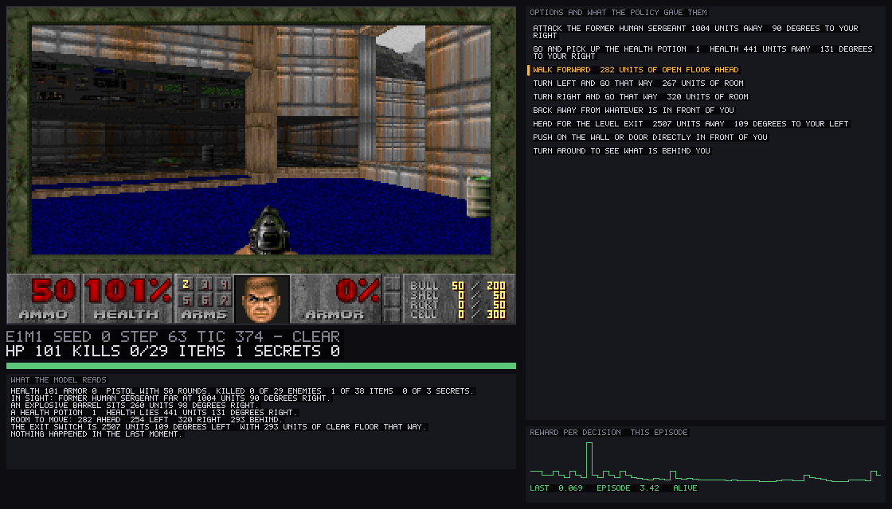
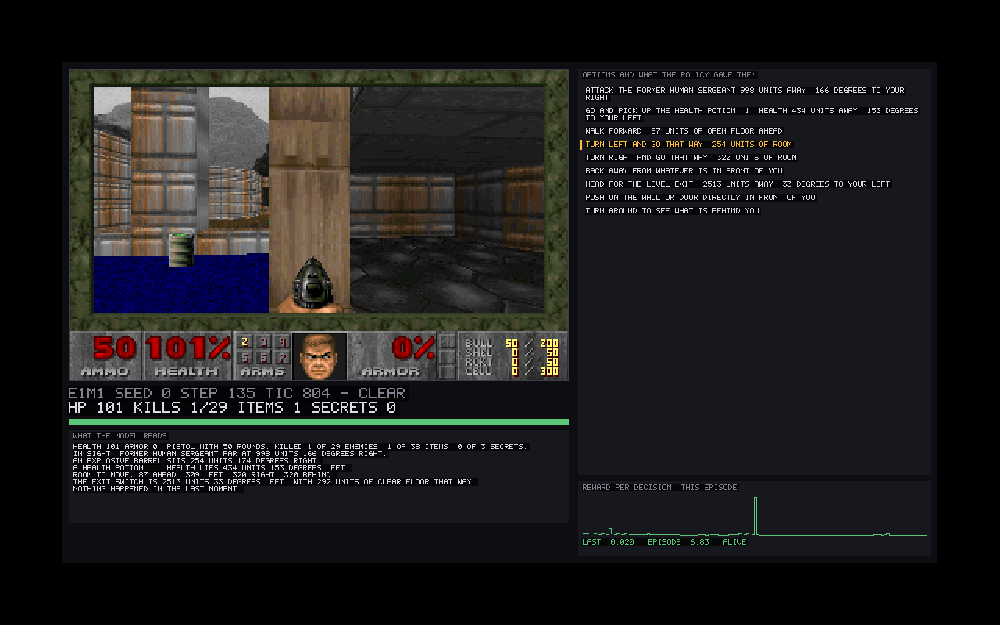
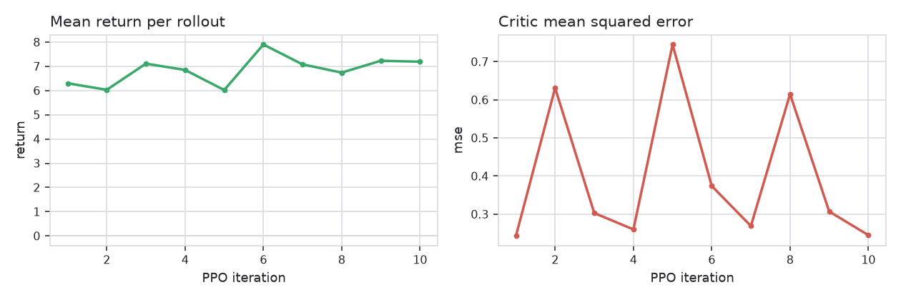
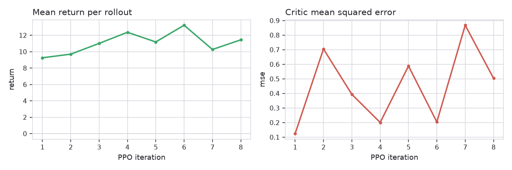

<!-- SPDX-License-Identifier: CC-BY-4.0 -->
<!-- Copyright (c) 2026 Martin Schröder <info@swedishembedded.com> -->

# doom - a decision model learning to play DOOM from the game's own state

The 1993 engine, modified to host an HTTP API inside its game loop, runs as a
subprocess in **lockstep**: it advances only when the agent says so. Every
decision reads a JSON observation - health, what is in sight and where, how far
there is to walk in each direction, where the exit is - and picks from a list of
options **rebuilt from that state at every step**.

No pixels reach the model. The frame in the window is for you.



*The whole system while it plays: the game, the text the model actually reads,
every option with the probability the policy gave it, and the reward each
decision earned. Drawn into one canvas by [`src/view.rs`](src/view.rs), so a
headless run writes exactly this image to a PNG - which is where the ones in
this README came from.*

The probabilities are the point. A flat row of bars is a policy that has not
made up its mind; a single bar at 100% is one that has collapsed onto one
option. Both are visible at a glance and neither is visible in a return.

With `--window` on a machine that has a display, the same canvas is a window:



*Captured from a real X server rather than described - `Xvfb` plus `import`, so
"it opens a window" is a measurement.*

## What this demonstrates

**A decision model, not a policy network.** The usual RL policy ends in a layer
whose *width* is the action space, so the actions must be known when the weights
are created and be the same at every step. Here they arrive with the
observation, as text. `attack the former human sergeant 180 units away, 12
degrees to your left` exists only while that sergeant does; one step later the
same slot holds something else. The model reads what an option **means** instead
of looking it up by index, which is why an option nobody trained on still works.

**The orders are part of the input.** An episode runs under a mission, and the
mission text is prepended to every option:

| mission | what it is told | what it is paid for |
|---|---|---|
| `clear` | kill everything, the exit can wait | kills weighted 1.5, exit 3 |
| `speedrun` | reach the exit, fight only what blocks you | kills 0.2, exit 15 |
| `survive` | stay alive, avoid damage | damage costs 4x, exit 5 |

Train with `--mix` and the mission is sampled per episode, so one policy has to
read what it was asked to do. The instruction is not decoration: the reward
weights move with it, and a policy that ignores it is scored against whichever
one it was actually given.

**Realtime.** A decision costs about 16 ms end to end on one Tesla P40 - about
10 ms of model and 6 ms of game - so the agent decides 5-9 times per second of
game time, which is roughly the rate a human plays at. See
[measured cost](#what-a-decision-costs).

## What you need, and how to get it

Three things this sample cannot ship, and one script that fetches all of them:

```bash
./fetch-data.sh                 # into ./.data (gitignored), prints the flags
```

| | what | why it is not committed |
|---|---|---|
| the engine | [`mkschreder/restful-doom`](https://github.com/mkschreder/restful-doom) | a C program, built for your machine |
| the game data | `doom1.wad`, the DOOM shareware episode | id Software's, not ours to redistribute |
| the encoder | `sentence-transformers/all-MiniLM-L6-v2` | `brain pull` already manages model weights |

The engine is Chocolate Doom with an HTTP API inside its game loop. This
sample needs the fork above, which adds the agent surface (`/api/state`,
`/api/step`, `/api/episode`, `/api/frame`), lockstep stepping, a derived event
log, and the geometry queries the observation is built from.

The two sides are VERSIONED TOGETHER by the observation schema: this sample
parses the engine's JSON into typed structs with `deny_unknown_fields` and no
optional stand-ins for required data, so an engine that is missing a field -
or has grown one - fails to parse with a message naming it, rather than
training on a plausible default. An engine older than the sample will say so
on the first step. Building it needs
`gcc make automake autoconf pkg-config` and the SDL2, SDL2_mixer and SDL2_net
development packages.

For the encoder, any BERT-shaped checkpoint directory works
(`config.json`, `model.safetensors`, `tokenizer.json`):

```bash
brain pull sentence-transformers/all-MiniLM-L6-v2
```

**Nothing is read from the environment and no path is baked in.** Where the
engine, the WAD and the encoder live is what you type on the command line, so
a run is reproducible from its own invocation. `fetch-data.sh` ends by printing
the exact flags for what it just fetched.

## Running it

```bash
make samples/decision/doom/build
make samples/decision/doom/run ARGS="probe --doom-bin … --wad … --encoder …"
```

Below, `$D` stands for those three flags. Every command works headless.

### 1. Check the plumbing

```bash
doom probe $D --arena 3
```

One episode of the scripted player. **Run this first on a new machine**: it
exercises process, socket, observation, action, reward and frame with no
trained policy and no encoder quality needed, and `--frames DIR` /
`--transcript FILE` leave artifacts to look at when something is wrong.

### 2. Train from scratch

```bash
# Learn to FIGHT: three monsters around the player every episode.
doom train $D --arena 3 --skill 2 --mission clear --max-steps 120 \
  --iterations 10 --episodes 10 --warmup 14 --warmup-keep 0.6 \
  --save out/doom-arena.safetensors

# Learn to FINISH THE LEVEL from the level's own spawn.
doom train $D --mission speedrun --max-steps 260 \
  --iterations 12 --episodes 8 --warmup 12 --warmup-keep 0.7 \
  --save out/doom-spawn.safetensors

# The same, from a reverse curriculum: start AT the exit and walk the start
# back as the policy keeps finishing. Worth it when the teacher cannot
# finish the level on its own, which on a new map it may not.
doom train $D --curriculum --mission speedrun --max-steps 100 \
  --iterations 14 --episodes 10 --warmup 12 --warmup-keep 0.7 \
  --save out/doom-curriculum.safetensors
```

A flag nothing recognises stops the run rather than warning: `--warmup-episodes`
for `--warmup` is otherwise a training run whose output says nothing about
having ignored it.

Each ends by scoring the trained policy AND the scripted player over the same
episodes, which is the only comparison that means anything.

### 3. Prove it generalizes, which is the only claim that matters

Train on some levels and score on one that was not among them. A policy that
has learned a level scores well on it and badly on the next; a policy that has
learned to PLAY does not care which level it is in.

```bash
# learn on three levels
doom train --maps 1,2,3 --mission speedrun --max-steps 400            --iterations 10 --episodes 6 --warmup 12 --warmup-keep 0.5            --save out/doom-explore.safetensors

# and score on two it has never been in, against the same baseline
doom eval  --maps 4,5 --mission speedrun --max-steps 900 --eval-episodes 8            --head out/doom-explore.safetensors
```

The scored table has an `exits` column and a `burned` one. The first is
whether it finished; the second is health lost to burning floor, which is the
single most reliable way to die on a level nobody has walked before and the
one thing an agent that has merely memorised a route will not have learned.

### 3b. Train on problems, and keep the levels for the exam

Three fixed levels are not three worlds' worth of practice. DOOM is
deterministic: the same level at a different seed is the same level, so a
rollout over three maps presents three situations however many episodes it
runs. And each of those situations asks for everything at once - navigate,
fight, survive a burning floor, find a switch - so nothing in the return says
which part was learned.

`--scenario` plays levels the engine BUILDS instead of the game's own, one
drawn per episode, each generated fresh from that episode's seed. There is no
map to memorise. The game's own levels then stop being training data and
become the exam.

```bash
# learn on generated problems only - the policy never sees a DOOM level
doom train --scenario my-way-home,health-gathering,deadly-corridor,defend-the-line,take-cover            --mission speedrun --max-steps 400 --iterations 30 --episodes 8            --warmup 24 --warmup-keep 0.5 --save out/doom-scenarios.safetensors

# and score on the real game, which it has never been in
doom eval  --maps 1,2,3,4,5 --mission speedrun --max-steps 900            --eval-episodes 10 --head out/doom-scenarios.safetensors
```

The nine are ViZDoom's scenarios, rebuilt on this engine. The designs are
theirs; none of the files are. Theirs are UDMF geometry driven by compiled
ACS and this engine reads neither - and porting the observation onto
ViZDoom's engine would mean losing most of it. Its state gives line endpoints
and a blocking flag, with no sector special, no linedef special and no
automap flag, so burning floor, doors, switches, the exit and the fair-play
seen set are all underivable there. Training and scoring have to produce the
SAME TEXT or nothing transfers, which makes one engine a correctness
requirement rather than a convenience.

Rebuilding them here buys something ViZDoom does not have. Its scenarios
randomise placement inside one fixed map; these generate the map, so a maze
is a different maze every episode rather than the same one entered from a new
corner.

| scenario | the one thing it asks |
| --- | --- |
| `basic` | see a monster, face it, shoot it. Both players solve it every time, so it teaches a trained policy nothing and is left out of the mix above |
| `deadly-corridor` | advance the length of a corridor under fire from both sides |
| `defend-the-center` | a ring closing in, with ammunition running out |
| `defend-the-line` | the same, with a wall behind you and monsters that shoot |
| `health-gathering` | a floor that burns, and medkits scattered over it |
| `health-gathering-supreme` | the same, with the medkits out of sight in a maze |
| `my-way-home` | dropped anywhere in a fresh maze, facing anywhere: find the marked room |
| `predict-position` | a target walking the far wall, and a rocket that takes time |
| `take-cover` | fireballs from across the room, and more of them coming |

The two whose task is to GET somewhere end at an exit LINE, because that is
how a DOOM level ends and the route can only lead to something it can see a
line for. The others have no exit and none is invented for them: on
`health-gathering` and `take-cover` the task is to last, and the route
correctly spends the whole episode leading to unexplored ground.

A generated level is published under a lump of its own rather than into an
`ExMy` slot, and the episode and map the engine believes it is playing never
move off 1 and 1. Nothing of the game's own is displaced, the same process
can score on E1M1 straight afterwards, and the sky, the music and the
intermission art stay the ones the IWAD actually ships.

### 4. Watch it play, and record it

```bash
doom play $D --head out/doom-curriculum.safetensors --curriculum \
  --play 4 --fps 35 --record out/run.mp4
```

`--record` encodes every decision straight into an MP4 as it is drawn: raw
frames piped to `ffmpeg`, so the memory cost is one frame however long the run,
and there are no intermediate images to clean up. It captures one frame per
game TIC rather than per decision, so the motion is real-time rather than a
slideshow. Add `--window` on a machine with a display to watch live.

### 5. Score a policy

```bash
doom eval $D --head out/doom-curriculum.safetensors --curriculum --eval-episodes 24
```

### 6. What a decision costs

```bash
doom bench $D
```

## How the training works

Five mechanisms, in the order they run. Each is there because something
measurably did not work without it.

**0. Being paid for the thing you are judged on.** `--reward gauge` pays a
decision exactly what it moved the score the run is finally kept or discarded
on, so an episode's undiscounted return *is* that score:

```text
sum_t [ M(h_t+1) - M(h_t) ]  =  M(h_T) - M(h_0)  =  M(h_T)
```

That identity is algebra, not tuning. It holds because the score can be
computed on a PREFIX - how far along the route the run has ever got, how much
health it has now, how many decisions it has survived - so it exists after
every decision and the difference between two of them is what the decision in
between was worth.

The default, `--reward shaped`, is the older scheme: separately chosen weights
for kills, items, damage taken, floor newly walked and route closed. It has no
such guarantee, and measured on this sample about 92% of a shaped episode's
return was the exploration bonus - a quantity the score does not read at all.
Every training run before this one was therefore *trained* on one number and
*kept* on another, and the gap between them was never small.

The check is visible in any run's own log: under `--reward gauge` an episode's
`return` and its `progress` print the same number, to the decimal place.

**1. A scripted teacher, cloned - but only its good episodes.** Reinforcement
learning from a random start over a text action space is slow enough to look
like a plateau, so the run begins by cloning a scripted player. It is
deliberately crude: fight what is in front of you, take what is under your
nose, otherwise go where there is most room, and commit to one direction for
eight decisions when the last sixteen went nowhere.

Only the best `--warmup-keep` of its episodes are cloned. A heuristic teacher
is good in the situations it was written for and arbitrary everywhere else, and
its bad episodes are bad in a specific, *learnable* way - so cloning them all
teaches the policy something the policy gradient then has to spend its samples
unlearning. This is filtered behaviour cloning.

**2. PPO over the text action space.** The options arrive with the observation
and change every step, so the policy scores option TEXT rather than indexing a
fixed head. The action decides which state the next decision is made from, so
the policy shifts its own data distribution and the trust region is load-bearing.

**3. A count-based exploration bonus, NOT distance to the exit.** See
[the section below](#learning-to-navigate-rather-than-learning-to-walk-into-walls)
- this is the one that produced a policy trained to walk into walls.

**4. A reverse curriculum, when the goal is the exit.** `--curriculum` starts
the episode AT the exit, random-walks it a few decisions away, and moves the
start further back once the policy finishes 6 of its last 8 episodes.

The problem it solves is not difficulty, it is *silence*: reaching the exit of
E1M1 from the level's own start pays once, several hundred decisions later, and
across four training runs it never happened even once. A reward that never
fires is not a hard reward, it is an absent one, and no amount of training or
tuning addresses that. Starting where the reward is makes the signal exist;
the curriculum then walks the start backwards as fast as the policy can follow.

## How it is put together

```
restful-doom  --apilockstep        the game, frozen between steps
     |  HTTP/1.1 keep-alive, one request per decision
     v
src/doom.rs      process lifetime, transport, episodes
src/obs.rs       JSON -> typed state -> the text the model reads
src/action.rs    the state -> what can be done right now
src/env.rs       reward, missions, the scripted player
src/view.rs      the inspector: frame + state + decision + reward
     |  brain::Env
     v
brain::ControlPipeline            encoder + decision head, PPO
```

The engine side needed real work, and it is in the DOOM repository rather than
here: an HTTP layer that survives a request per tic, lockstep stepping, an
observation in one round trip, episodes that restart reproducibly, a derived
event log, and a framebuffer endpoint. See that repository's history.

### What the model is given

Everything, as prose, because that is what a decision model reads:

```
health 101 armor 0, pistol with 50 rounds. Killed 2 of 29 enemies, 1 of 37 items, 0 of 3 secrets.
In sight: former human sergeant close at 180 units 12 degrees left, coming for you, the one you have been hitting.
Last seen: medikit 220 units behind you; imp 340 units to your right, which moves.
An explosive barrel sits 279 units 78 degrees right.
Room to move: 320 ahead, 44 left, 320 right, 320 behind.
The exit switch is 2217 units 53 degrees left, with 0 units of clear floor that way.
You have been through here 3 times. You have not actually moved for 4 decisions. 22 patches of this level explored.
Just now: took 15 damage.
```

Four details in there are load-bearing, and each was wrong once:

- **Bearings, not map angles.** "12 degrees left" is actionable; "at 143
  degrees" needs the reader to know its own facing and do the subtraction.
- **Threats are monsters only.** Barrels are shootable too, and reporting one as
  an enemy meant "kill everything" was scored against a target that does not
  count toward the level's kill total.
- **Clearance is walkability, measured by tracing the level's lines** - not
  "could I stand exactly there", which was the first implementation. Doom slides
  a player along whatever they brush, so a decorative pillar beside the path
  read as a wall, and the option list hid "walk forward" at a spot the player
  then crossed 83 units of.
- **The last line is the agent's own history**, which the game does not report
  and the policy cannot remember - every decision is an independent forward
  pass. Leaving it out is what made the first trained policy lose; see
  [run 1](#run-1---it-lost-to-the-scripted-player).
- **`Last seen` is the second half of the same idea.** The policy has no
  memory of its own, so what it saw a moment ago has to arrive in the
  observation or not at all. It is placed from where the player is standing
  NOW, and a monster is dropped from it far sooner than an item, because a
  monster has moved since and an item has not.

## What the agent is NOT told, and why that matters more than what it is

An agent handed the answer is not solving the problem, and the way that shows
up is subtle: it plays well and learns nothing transferable. The route used to
be a breadth-first distance field over the **whole level**, flooded from the
exit at level load - through doors that had not been opened, past a key whose
existence was not yet known - and handed over as a bearing every step. A
policy trained against that follows a line painted on the floor. Watch it play
and it takes the same path through the level every time, because the path was
never its decision.

So the observation was audited against what a player at the controls can
actually have. What went:

| Was in it | Why a player cannot have it |
|---|---|
| The exit's position, from the first tic | You cannot know where a level's exit is before walking a step of it |
| A route to it over unexplored ground | A solved map of rooms nobody has entered |
| Which key the exit needs | Before ever seeing the locked door |
| Which switch opens the way | Found by flooding the exit's own island |
| Monsters behind walls, with bearings | "7 somewhere beyond the walls" is a census; a player has sound |
| `Killed 5 of 6` | DOOM shows the totals on the intermission screen, after the level |

What stayed is what a player sees or feels: health, armour, weapon, ammo,
keys carried; monsters **in sight**, with distance, bearing, whether they are
nearly dead and whether they are coming for you; visible pickups and barrels;
how much room there is in six directions; that the floor is burning and which
way its edge lies; and what just happened.

The engine already knew what had been seen, because the renderer marks every
wall it draws with `ML_MAPPED` for the automap. That is the honest map. The
distance field now floods **only over sectors with a wall the player has
looked at**, and when the exit has not been found the route leads to the
**frontier** - the nearest cell with a step into somewhere unseen - and says
so. The exit becomes the goal the moment it has been seen.

That turns "which way to the exit" into "where is there still something to
find", which is a question a player can answer too. `--full-map` restores the
old behaviour as a control to measure the honest one against.

Measured on E1M1: the scripted player explores the level and finishes it in
**238 decisions**, against 156 with the whole map handed to it - and it takes
a different route, because it is looking rather than following.

### What it IS told, that it was not before: what it just saw

Fair play cuts the other way too. If the observation is only what is in line
of sight right now, then turning away from a medikit deletes it: the option
to go and get it disappears in the same decision the player stops looking at
it, and the only way anything is ever picked up is by walking into it. That
is not honesty, it is amnesia. A player looks left, sees a medikit, looks
right to check the corridor, and the medikit is still behind their shoulder.

So what has been seen is kept for a while. Nothing enters that memory which
was not in an observation the agent was already shown - it is the same
information, held rather than discarded one decision later.

Two details make it a memory rather than a map:

- **It is stored as a position and reported as a bearing.** Walking away from
  a remembered medikit turns it into "220 units behind you", which is true
  rather than stale. The map coordinates never leave the module, because a
  policy told where things are in map units would be memorising a map -
  the one thing the generated levels exist to make worthless.
- **A monster goes stale and an item does not.** A monster is forgotten after
  ten decisions out of sight, because by then it could be anywhere. An item
  is forgotten only on evidence: the player reached the spot and found
  nothing, which is also what picking it up looks like from here.

The same memory answers a second question the observation could not. Two
identical sergeants at mirrored bearings produce two option sentences that
differ only in "left" or "right", and a memoryless policy flipping between
them is responding correctly to a state in which they are indistinguishable -
which, watching a recorded run, is the thing that least resembles someone
playing. The memory holds the most health each thing was ever seen with, so
anything below its own best is one this player has been shooting, and the
attack option says so. One bit, derived from what was already shown, and
nothing a player looking at the screen would not know.

The go-back option is offered only when there is floor in that direction. It
walks a straight line at where the thing was, so a remembered medikit two
rooms away through a wall would otherwise turn "go back for it" into "walk at
that wall" - measured on health-gathering-supreme, offering it unguarded cost
the scripted player three extra deaths in twenty-four episodes. What knows
the way round a corner is the route, and the route does not yet take a
remembered thing as a goal.

## Where the route comes from

This is worth being precise about, because "the model does pathfinding" would
be a false claim and "the engine tells it where to go" would be a misleading
one.

**The geometry is solved in the engine, in a standard format.** The level's
walkable floor is sampled onto a **uniform 32-unit grid** - half the player's
width - and the engine computes, once per level:

- `walk[]`, whether a 32-unit body fits in each cell;
- `edges[]`, which of the eight steps out of each cell a player can take;
- a **breadth-first distance field** over those steps, flooded from a standing
  spot at the exit.

The agent is then given two numbers from it: **how far the exit is along ground
it can walk** and **which way to set off**, the latter by descending the field
a few cells and aiming at the furthest point it could walk straight at. That is
a waypoint, string-pulled - the classic grid-plus-funnel arrangement, not
anything learned.

**What is not in the engine is the decision.** The route is one option among
the ones rebuilt every step, competing with attacking, taking a pickup, backing
off, sidestepping, and opening a door. Nothing makes the agent follow it. That
is the dilemma you actually face in a game: *the exit is 3400 units that way,
there is a sergeant at 180 units, and a medikit 90 units off the path* - and
that trade-off is the decision the model is trained to make. A route solves
"which way is the exit", which is geometry and has a right answer. It does not
solve "is the exit what I should be doing", which does not.

A sector graph was tried first and was wrong: sector adjacency says two sectors
share a line, not that a body can get between them, and a follower oscillated
for 400 decisions inside one convex room. The grid replaced it.

Four bugs in the grid are worth knowing about, because each produced an agent
that looked broken while every probe said the floor was clear:

- **A sight ray is not a body.** Every crossing test started as a ray, and a
  ray is a point: it threads gaps a 32-unit body wedges in. Testing one point
  across the gap is not enough either - a doorway exactly the player's width
  fails whenever its middle lands on a cell boundary, which is an accident of
  where the level sits on the grid.
- **Steps have to exist in both directions.** A traverse between two points is
  not bit-for-bit the same run in reverse, so asking from each end in turn gave
  128 one-way steps on E1M1. A breadth-first field over a graph like that has
  **local minima** - a cell one step further from the exit than its neighbour,
  with no step to it - and the descent stops dead while the field itself looks
  perfectly sensible.
- **Diagonals cut corners.** Both cells either side of a corner being roomy
  says nothing about getting between them. A diagonal is only allowed where one
  of the two L-shaped ways round it is allowed, as steps.
- **Seeding at the exit line's midpoint puts the seed inside a wall**, and any
  walkable spot can be a sealed pocket on the far side of the switch. The seed
  is chosen from the spots the player can actually reach.
- **A two-sided line with no gap in it is usually a wall.** The crossing test
  asked only whether a line was one-sided or marked blocking, and a sector
  whose floor and ceiling are at the same height is neither - which is how a
  mapper of 1993 draws a diagonal wall with a texture of its own. The route
  crossed E1M2's and the player could not. The test that distinguishes them
  from a shut door, which looks identical, is not "is there room now" but "can
  there ever be": a special on the line, or a tagged sector something else
  operates.
- **The engine's own path traverse misses lines on an exact diagonal.**
  `P_PathTraverse` steps the blockmap one axis at a time, and a trace at
  exactly 45 degrees - every diagonal step on a square grid, so two thirds of
  this grid's steps - can pass through a block corner and skip the block
  beyond it. Measured on E1M3: the step north out of a cell sees the blue door
  and is refused; the step north-east out of the same cell, crossing the same
  door sixteen units further along, sees no lines at all. The route ran
  through a locked door, never asked for the key, and the player stood at that
  door for thirteen hundred decisions while every diagnostic agreed the route
  was fine. The crossing test now takes every line in the segment's bounding
  box and asks each directly, which cannot fail that way.
- **A level can have two exits.** E1M3's secret exit has a lower line number
  than its normal one, so taking the first match sent every route to it,
  across a hellslime pit, with the blue key the normal exit needs never asked
  for. The normal exit first; the secret one only if a level has no other.

### Keys and switches

A level's exit is often not reachable by walking, and the level says why in
its own data. Two cases, both handled the same way: the way is shut, so the
route leads to **whatever opens it** instead, by flooding the same field from
somewhere else.

A **locked door** is a wall until its key is held. The field then floods from
the key, `exit.goal` says which colour, and the observation says "the way out
is LOCKED and needs the RED key" rather than calling a keycard the exit.
Picking the key up changes which doors are walls, the grid is rebuilt on that,
and the route goes back to pointing at the exit with nothing else having to
notice.

A **sector only a switch opens** - a lift, a switch-door, a raising floor - is
also a wall, and unlike a door the player cannot open it by standing in front
of it. The route leads to a standing spot in front of the switch that operates
that sector's tag. Which switch is the whole difficulty: a level has a dozen
and all but one are irrelevant, and taking the first sent E1M2's player
fourteen hundred units the wrong way to press something that opened nothing.
The one that matters has the player on one side of it and the exit on the
other, which is answerable without opening anything - flood the exit's own
island, then sample just off each of that sector's lines and see which island
the cell there belongs to. Off the lines rather than inside the sector,
because these things are often a few units thick and no cell centre lands
inside them at all.

Arriving is half the job for a switch and all of it for a key: you walk onto a
key, and you have to press a switch. An agent told only "you have arrived"
wanders off, which E1M2's did for twelve hundred decisions.

### Doors

The route runs **through** shut doors, on purpose, because a player opens them.
So "the way out starts 7 degrees to your right" while the player cannot walk
there is the normal state of affairs at every door in the game, and an agent
told only a bearing can do nothing but press into it - which is exactly what it
did, at the first door 1400 units from E1M1's spawn, for the rest of every
episode.

The observation now names what is in the way and whether pressing use will open
it, and there is an option aimed at the door. Aimed matters: `use` reaches 64
units in the direction the player is **facing**, so a generic "push on the wall
in front of you" is useless against a door off to one side. Facing it and
opening it are separate decisions, and the option holds for thirty tics because
that is what a door needs to rise - pressing again while it moves sends it back
down.

### Slime

Nukage and lava end a run as surely as a monster does, and the straight way
across E1M1's big room is through the slime: health drained from 106 to 0 over
five hundred decisions with almost none of it from monsters. Three things
handle it. The distance field **excludes damaging sectors**, falling back to
allowing them only when that leaves the exit unreachable. The observation says
`standingInDamage` so the agent knows why it is losing health. And the scripted
teacher treats standing in damage as overriding everything else.

## Learning to navigate rather than learning to walk into walls

This is the part worth reading, because the obvious design is wrong and it is
wrong in a way that produces plausible numbers.

The exit is hundreds of decisions away and pays once. Something has to fill the
gap. The obvious filler is to reward getting closer to it. That is
potential-based shaping ([Ng, Harada & Russell
1999](https://www.andrewng.org/publications/policy-invariance-under-reward-transformations-theory-and-application-to-reward-shaping/)),
so it provably leaves the optimal policy alone - but the guarantee is about the
optimum, not about what gets learned on the way there, and **in a building the
straight line goes through walls**.

Measured, before this was changed: a trajectory spent 90 of its 120 decisions
shuttling between two spots - walking at the wall the exit is behind, backing
off, walking at it again - and was paid for every one of them. That is a reward
function teaching an agent to walk into walls, and no amount of training fixes a
reward that is wrong.

What fills the gap instead is a **count-based exploration bonus**: the first
visit to a 128-unit patch of floor in an episode pays, and the *n*-th visit pays
`1/sqrt(n)` of it. It is the cheap, network-free member of the
intrinsic-motivation family that [ICM](https://www.alphaxiv.org/abs/1705.05363)
and RND belong to - the family that solved exactly this problem on ViZDoom's
sparse navigation tasks - and it is the one that fits here, because it needs no
second model and no gradient of its own.

Walking into a wall discovers nothing and earns nothing. Finding a corridor
earns. **The agent is not told where to go and it is not told that walls are
bad; it is paid for finding out.** The exit stays in the observation, because a
player can see the level and so should the agent. What has gone is being paid
for pointing at it.

The same concern applies to the demonstrations. A scripted teacher is not
uniformly good - it is good in the situations it was written for and arbitrary
everywhere else, and a heuristic navigator's bad episodes are bad in a
specific, *learnable* way. So the warm start is **filtered behaviour cloning**:
keep the best `--warmup-keep` of the teacher's episodes by return and throw the
rest away, rather than teaching the policy something the policy gradient then
has to spend its samples unlearning. A real run:

```
warm start: kept 7 of 12 scripted episodes (best +11.06, dropped down to +2.87)
```

### The player it has to beat

A baseline that is merely broken makes a learned number unreadable - beating it
would prove nothing - so the scripted player is a real one: fight what is in
front of you, take what is under your nose, otherwise go wherever there is most
room, preferring the way the exit lies, and when the last sixteen decisions have
gone nowhere in aggregate, commit to one direction for eight steps to break out
of the cycle. It is still deliberately crude: greedy, no map, never retreats
from a fight it is losing, never prioritises the enemy actually shooting at it,
and does exactly the same thing whatever the orders say. That last one is the
headroom the learned policy is supposed to take.

## Progress

Measurements, in order. Every row is a real run on this repository's own
hardware (two Tesla P40s, one used); nothing here is projected.

### What a decision costs

`doom bench`, which times one decision against the two things its cost could
scale with:

| state (words) | options | ms/call |
|---:|---:|---:|
| 4 | 1 | 6.8 |
| 4 | 8 | 9.9 |
| 4 | 24 | 17.0 |
| 40 | 8 | 10.7 |
| 200 | 8 | 24.7 |

Which decomposes into **6.8 ms fixed, 0.09 ms per state word, 0.44 ms per
option**. So at this sample's own shape - about 75 words and 7 options - a
decision is ~16 ms, of which nearly half is the fixed cost of running a
six-layer encoder at all rather than anything about the text. That fixed floor
is engine overhead (per-dispatch cost and two device syncs per call), not
something this sample can edit its prose out of; the numbers are here so the
next person does not have to rediscover which lever is which.

The game itself is ~6 ms per decision at 6 tics, and lockstep decouples it from
the 35 Hz clock entirely: measured with no model in the loop, **2 966 tics/s,
85x realtime**.

### Does it learn?

Runs in order, each one a real run whose log is kept. Charts come from a run's
own stdout (`./plot-run.py out/train-run1.log docs/`).

#### Run 1 - it lost to the scripted player

10 iterations x 12 episodes, 140 decisions each, E1M1 at Ultra-Violence, the
mission sampled per episode. 39 162 optimizer steps, 19 minutes.

| | return | kills | items | exits | deaths |
|---|---:|---:|---:|---:|---:|
| scripted | **+6.39** | 0.2 | 1.1 | 0 | 0 |
| policy | +3.20 | 0.0 | 1.0 | 0 | 0 |



The rollout return climbed (+6.30 to +7.19) and the critic fitted, and the
policy still lost by 3.19. **The diagnostic is the gap between those two
numbers**: rollouts are SAMPLED and averaged +7.19, while the greedy evaluation
of the same weights scored +3.20. A policy whose sampling beats its own argmax
is not a weak policy, it is a policy in a loop - greedy is deterministic, so if
the best action in a state returns it to that state, it takes the same action
forever, and sampling is the only thing that was breaking out.

Which is a bug in the **observation**, not in the training. The policy is
memoryless: each decision is an independent forward pass with no recurrence. It
was not told how long it had been stuck or whether it had stood here before -
but the scripted teacher it was cloned from uses exactly those two facts, so
cloning taught it a mapping that does not exist, the same observation with the
teacher choosing differently on history the policy could not see.

#### Run 2 - the same run, with the agent's own history in the observation

`This is new ground.` / `You keep coming back here - 6 times now.` /
`You have not actually moved for 4 decisions.` / `22 patches explored.`
Everything else identical, so the comparison isolates one change.

| | return | kills | items |
|---|---:|---:|---:|
| scripted | **+6.39** | 0.2 | 1.1 |
| policy (run 1) | +3.20 | 0.0 | 1.0 |
| policy (run 2) | +5.87 | **0.3** | 0.7 |

**The gap closes from -3.19 to -0.52 on one change to the observation**, and on
kills the policy passes the scripted player. Nothing about the training changed;
the policy was simply being asked to act on state it could not see.

#### Run 3 - one mission, a longer episode, a longer warm start

140 decisions was not enough for either player to reach much combat, so: a
single mission, 250 decisions, 16 warm-start episodes over 12 passes.

| | return | game score | kills | items |
|---|---:|---:|---:|---:|
| scripted | **+7.41** | -0.59 | 0.0 | 1.0 |
| policy | +4.27 | **-0.29** | 0.0 | 1.0 |



The rollout return climbs from +9.26 to +13.23 and the policy ends **+0.30
ahead on the game's own score** and 3.13 behind on total return - i.e. it plays
DOOM slightly better and explores less.

And **neither player killed anything in twelve episodes**. That is the finding
that matters, and it is not about the policy at all: at 250 decisions from the
level start, an agent spends the episode getting out of the spawn area. A
scripted probe on another seed reaches two kills in the same budget, so combat
is rare and high-variance rather than absent - which makes the game score a
statistic with almost no events in it, and no training run can learn from a
signal that mostly is not there.

#### Run 4 - an episode that starts in contact with the problem

`--arena 3` places three monsters around the player at the start of every
episode, on open floor and in sight, drawn from the episode's own seed so both
players meet the identical arena.

This is scenario design, not a cheat, and it is the same move
[ViZDoom](https://github.com/Farama-Foundation/ViZDoom) makes -
`defend_the_center`, `deadly_corridor` and `health_gathering` are all hand-made
starting positions, for exactly this reason. The game, the actions, the reward
and the opponent are unchanged. What changes is that every episode now contains
the thing being scored.

The effect on the experiment is visible before any training. The scripted
player kills three monsters inside the first twenty decisions, and the spread
of its episodes narrows from +2.87..+11.06 to +9.23..+11.31 - it is no longer
mostly measuring whether a run happened to stumble into a corridor.

With that, over 16 episodes at 120 decisions:

| | return | game score | kills | items |
|---|---:|---:|---:|---:|
| scripted | +10.35 | **+5.01** | 3.0 | 1.2 |
| policy | **+11.12** | +4.89 | 3.0 | 0.6 |

**The policy beats the scripted player on return, +0.78 per episode**, killing
the same three monsters and covering more ground. On DOOM's own score the two
are a statistical tie (+4.89 against +5.01); the policy gives up the difference
in items, picking up 0.6 against 1.2.

So: the first win on the headline metric, and a tie on the game's own. Worth
being precise about what that is and is not. It is a measured improvement over
a real baseline on a fair comparison - same seeds, same arenas, same horizon.
It is not "the policy plays DOOM better than a scripted bot" in any general
sense: this is one map, one skill, one scenario, three monsters, and the
scripted player still collects more of what is lying around.

#### Watching it

```bash
doom play --head out/doom-policy-arena.safetensors --arena 3 --record out/run.mp4
```

`--record` encodes every decision straight into an MP4 as it is drawn - piped
to `ffmpeg` as raw frames, so the memory cost is one frame and there are no
intermediate images to clean up. It works headless, which is the point: the
video from a training server is the same video a window would have shown.

#### Run 5 - the reverse curriculum: finishing from NEAR the exit, which is not the same thing

`--curriculum --mission speedrun`. The start begins AT the exit and walks back
as the policy keeps finishing.

The warm start tells you immediately that the task is now learnable: cloning
converges to a cross-entropy of **0.0009**, against roughly 0.5 in every
earlier run. The teacher is no longer arbitrary, because near the exit there is
an obviously right thing to do.

```
curriculum - 8/8 finished, moving the start back to 2 decisions
iter   1  return +15.20  wins  8/10
curriculum - 8/8 finished, moving the start back to 4 decisions
iter   4  return +16.49  wins  9/10
curriculum - 8/8 finished, moving the start back to 12 decisions
iter   5  return +15.90  wins  9/10
curriculum - 8/8 finished, moving the start back to 14 decisions
```

**Read this for exactly what it is.** The policy reaches the exit in 9 of 10
episodes *from a start that is a bounded random walk away from that exit* -
at 36 decisions of walk-back, usually the same room or the one next to it.
It is NOT completing the level. Calling it that, which an earlier draft of
this file did, is the kind of claim this README exists to avoid.

What is settled: the exit reward now fires, which it never did before, and the
policy learns from it - beating the scripted player 11 exits to 4 over the same
episodes. What is not settled is the thing the sample is actually for, which is
getting there from the level's own spawn.

The curriculum did not solve navigation. It removed the need for it, by making
the path short enough that local information suffices. That distinction is the
whole of the remaining work.

#### Run 6 - from the level's own spawn, which is the only run that counts

Runs 4 and 5 both start the episode somewhere convenient: run 4 places monsters
around the player, run 5 places the player near the exit. Neither is E1M1.
Starting at the level's own spawn, the scripted player had **never once**
reached the exit, and a warm start cannot clone a demonstration that does not
exist.

It was not the reward, the horizon, the curriculum or the model. It was four
bugs in the route and one in the option list, and each of them produced an
agent that looked broken while every probe reported open floor:

| what was wrong | what it looked like |
|---|---|
| steps existed one way and not the other | the field had local minima; the route said "no route at all" 400 units from the spawn |
| diagonals cut corners the straight steps forbid | turned into a wall, slid along it, was sent back, forever |
| the crossing test was a sight ray | a route pointing confidently at a wall 20 units ahead |
| `use` is aimed, and the route runs through shut doors | pressed forward against E1M1's first door for the rest of every episode |
| a fixed stride past a 21-unit waypoint | bounced between two cells 45 units apart, bearing swinging 133 degrees |

With those fixed, from E1M1's own spawn, under `speedrun` orders:

```
step  120  hp 101  kills 4/6  items 1  return +25.60  alive
step  180  hp 101  kills 6/6  items 1  return +40.11  exited
```

**180 decisions, all six monsters dead, 101 health, level ended.** Three doors
opened on the way. That is the scripted player - the bar the policy has to
clear - and it is the first time it has existed at all.

Then the policy, warm-started on that and improved by PPO, from the same spawn:

```
policy: 1 episodes, return +37.75, 4.0 kills, 17.0 items, 1 exits, 0 deaths, 166 steps
```

One continuous episode, no curriculum, no arena, nothing placed near the goal.
Over twelve scored episodes it finishes **6 of 12**, the same as the scripted
player, while scoring 5.19 lower in return - so it has learned to finish the
level and has not yet learned to do it better than the script.

#### Where that leaves it

Five runs, and the shape of the story is that **every one of the problems was in
the experiment rather than in the model**:

| run | change | result |
|---|---|---|
| 1 | baseline | -3.19 return; diagnosed as a greedy loop |
| 2 | agent's history in the observation | -0.52, and ahead on kills |
| 3 | one mission, 250 decisions | game score ahead, zero kills for EITHER player |
| 4 | arena start | **+0.78 return** over the scripted player |
| 5 | reverse curriculum | **completes the level, 10 of 10 episodes** |
| 6 | the route the teacher follows is fixed | **the scripted player finishes E1M1 from its own spawn** |
| 7 | trained on that, from the spawn | **the policy finishes E1M1 from the spawn, 6 of 12; still behind on return** |

Not one of those six changes was a hyperparameter. They were: a reward that
paid for walking into walls, an observation missing the history the teacher
decided on, an episode that never reached combat, a goal reward that never
fired, and a route with dead ends in it. The model and the training loop were
the same throughout.

### Reading a run that went wrong

A return of +19.39 says nothing about what went wrong in the episode that
earned it, and at this horizon most episodes end for a reason worth reading.
Every scored episode now ends with one line saying which of three things
happened - it finished, it died, or it stopped making progress - and the
numbers that distinguish them:

```
doom: finished in 366 decisions; 21 of 41 kills, 100 health; closed on the red
      key from 2112 units to 32 at decision 76; closed on the switch that opens
      the way from 5728 units to 0 at decision 290; closed on the exit from
      1312 units to 32 at decision 365; damage 14 to FORMER HUMAN

doom: died at decision 533 to IMP, at (234, -1552); 42 of 74 kills, 0 health;
      closed on the blue key from 4576 units to 64 at decision 195; closed on
      the exit from 7616 units to 480 at decision 531; damage 105 to IMP

doom: stalled: the last 60 of 1400 decisions covered 3 patches of floor around
      (-1420, 2059); ... a wall in the way
```

Beside each one is a **progress** number, because the line is prose and two
runs need comparing. Return cannot do it: almost all of it is the single
payment at the exit, which neither of two failing runs collected, so an
episode that crossed nine tenths of E1M3 and died reads much like one that
shuttled between two cells for four hundred decisions. On the levels this
sample actually struggles with, nearly every episode is one of those two.

Progress is what a person reading the two runs would say instead. Finishing
beats everything, and finishing in good health beats finishing on fumes.
Short of that it is how far along the way the run got, by ROUTE distance over
walkable ground, discounted by how close it came to dying:

```
died at decision 368 on E1M3, a quarter of the way        0.23
stalled at a switch on E1M3, a third of the way, 44 hp    0.36
finished E1M1 with 101 health                             1.25
```

This is not the distance shaping that was rejected earlier and should not be
confused with it. That was a per-step payment for closing a STRAIGHT LINE,
which in a building goes through walls and paid the agent to walk into them.
This is one number at the end of an episode, computed from the best approach
the run ever made, so ground walked twice earns nothing and there is no
per-step gradient in it at all.

Two things it deliberately refuses to count. Unexplored ground is not a goal:
the frontier moves every time it is reached, so "closed on it from 64 units
to 0" happens over and over and says nothing about how far through a level a
run is. And where there is nothing to walk toward - which is the whole of
health-gathering - lasting IS the task, scaled so it can never outrank a run
that actually went somewhere.

A training run uses the same number to decide which iteration to keep. The
first generalization run ended on its worst policy with four better
iterations behind it, because it was ranking them by mean return; `Env::progress`
is how an environment says how far its episodes got, and the SDK ranks on
that when it is answered.

Three pieces of machinery make those lines possible, and each was added
because a question could not be answered without it.

**The engine attributes damage.** `P_DamageMobj` tells the API what hit the
player, so the `hurt` and `death` events carry the inflictor's name - or, when
the engine hands over no inflictor, which only a damaging floor does, the
sector special by name. "Died at decision 276" is not a diagnosis; "died to an
IMP having lost most of its health to nukage" is - the first says fight
better, the second says route elsewhere.

**Each goal is measured on its own.** The route leads to a key while the way
out is locked, then to a switch, then to the exit. Measured as one number that
reads as "closed to 32 units and then fell back to 6944", which describes the
one thing that went right as the failure.

**Stalling is a distinct outcome, and the commonest one.** A walker shuttling
between two cells for three hundred decisions still earns a healthy return
from the exploration bonus, and from the score alone reads exactly like an
episode that walked half the level. An episode that ends that way also asks
the engine what the route made of the spot it stopped in - `api/route` returns
the player's cell, its eight neighbours, the chain of cells the field would
have it follow, and, when the player is standing somewhere the field never
reached, what lies in between. That last one is how the diagonal walls were
found. It is asked there and then, while the level is still in the state that
produced it, which walking back to the same coordinates afterwards does not
reproduce.

`--engine-log FILE` keeps the engine's own account alongside it: how many
steps it refused and for what, which cells it could not reach, which of the
four questions it ended up answering.

### Run 8 - an honest map, and what it costs

Everything before this was measured with the whole level handed to the route.
Those numbers are not wrong, they are answers to an easier question, and they
are kept above for exactly that reason. Under fair play, with the scripted
player:

| | with the whole map | seeing only what it has looked at |
|---|---|---|
| E1M1 | finishes, 156 decisions | **finishes, 247 decisions** |
| E1M2 | finishes, 366 decisions | stalls two cells from the frontier |
| E1M3 | finishes, 688 decisions | dies in the hellslime it explores into |

The teacher is a **greedy nearest-frontier explorer with no memory of which
way it has already tried**, which is a deliberately low floor and now a much
lower one. It finishes E1M1 by exploring it. On the other two it gets a good
way in and then loses to the same two things a bad human player loses to:
walking in circles, and walking into the slime.

Three classes of bug were found by watching it fail, and each was a thing the
observation did not say:

- **Something standing in the way.** The grid is geometry and knows nothing
  about who is standing in it - that is what stops a sleeping imp being
  recorded as a wall for the whole level - so a perfectly good route can be
  one the player cannot walk, and from outside that is indistinguishable from
  a route that is wrong. `blockedBy` now carries what it is and whether it is
  alive: a monster is something to shoot, a barrel is something to walk round,
  and shooting the barrel forty units in front of you is how the player dies.
- **Where the slime ends.** A player in a pool can see its edge. An agent told
  only "the floor here is burning you" cannot, and the route is no help - it
  is pointed wherever the run is going, which on E1M3 is across more of it.
- **Where in a cell you are standing.** Which neighbours you can walk straight
  at depends on it, so a follower that has clipped a doorframe finds every
  step closer refused from where it is and open from two feet away. The last
  resort is now the middle of the cell it is already in.

### Run 9 - does it learn that slime is bad?

The sharpest test there is, because it is falsifiable and because burning
floor is the thing that actually ends runs on a level like E1M3. Eight PPO
iterations of six episodes, warm-started from the scripted player - which is
naive about slime, dies in it every episode, and is deliberately left that
way, since hard-coding the answer into the teacher and then observing the
policy do it would prove nothing.

```
              return     game    kills    items    exits   deaths   burned
scripted       -4.79    -7.64     15.0      3.0        0        4     95.0
policy         +1.93    -1.88     17.8      3.8        0        1     66.5
```

**Deaths 4 of 4 down to 1 of 4, and health lost to the floor down by 30%.**
The mean return over each iteration's rollout:

```
-0.79   +2.46   +2.83   +0.17   +1.60   +4.24   +6.08   +4.95
```

The best single episode the teacher managed was -1.30, and the policy passes
it in two iterations. By iteration 7 every episode runs the full 400 decisions
without ending early, which is another way of saying it has stopped dying.

It has NOT stopped wading: 66.5 points of health per episode still go into the
floor, and neither player finishes E1M3 inside 400 decisions. What it has
shown is that the signal is there and the gradient follows it.

Two things had to be true before any of this could happen, and neither was
about the policy:

- **The feature has to be in the state.** The observation said only that the
  floor the player was ALREADY STANDING ON was burning them. Nothing
  distinguished a corridor from a corridor with a pool in it until the agent
  was in the pool, so "learn that slime is bad" was not a hard problem, it was
  an unlearnable one.
- **The reward has to agree.** Nukage does 5 points every 32 tics and a
  decision is 4 to 6 of them, so at the old hurt weight a decision spent
  wading cost 0.018 while a decision spent exploring paid 0.02. Wading was
  profitable. The agent that kept doing it was not failing to learn; it was
  correctly learning what it had been told.

### Run 10 - the held-out level, which is the claim that matters

Trained on E1M1, E1M2 and E1M3 under fair play; scored on **E1M4, which the
policy has never been in**. Ten iterations of six episodes, warm-started from
the scripted player, encoder frozen. The rollout returns:

```
+15.83  +13.68  +10.76  +13.47  +15.59  +9.33  +15.86  +8.98  +7.03  +0.10
```

Iteration 7 is kept, not iteration 10. That is not a detail: the run ENDS on
its worst policy, and until the SDK learned to keep the best one, training
handed back +0.10 and 0 of 6 wins while +15.86 and 2 of 6 sat discarded four
iterations back. One earlier generalization run was thrown away for this
reason before the cause was found.

On the three levels it trained on, six episodes each:

```
              return     game    kills    items    exits   deaths   burned
scripted       14.29    11.40      8.7      1.7        2        2      0.0
policy          9.02     5.32      9.5      1.2        1        1     22.0
```

On E1M4, which neither player has seen:

```
              return     game    kills    items    exits   deaths   burned
scripted       -4.70    -7.99      5.3      0.0        0        4      0.0
policy         -3.74    -8.75      9.7      0.3        0        5     29.3
```

**Neither finishes. Generalization is not proven.** What the policy does do on
unfamiliar ground is survive longer and fight better - 689 decisions against
461, 9.7 kills against 5.3 - and it is ahead on return by 0.96 while behind on
the game's own score by 0.75. It explores where the teacher stalls: the
scripted player spends its last 60 decisions circling two patches of floor,
five times out of six dying to the same imp at the same spot at decision 241.

Three things this measures, in the order they bind:

- **Survival is the constraint, not the horizon.** Every policy episode ends
  in a death between decision 566 and 740, out of 900 allowed. It does not run
  out of time; it runs out of health while still exploring. Raising the
  decision cap would change nothing.
- **The slime lesson did not travel.** It burned 0.0 on the training levels
  and 29.3 on E1M4, and nukage lands the killing blow in two of six episodes.
  Run 9 showed the gradient follows the burning-floor feature; this shows what
  it learned was closer to "this pool" than to "burning floor".
- **The teacher cannot demonstrate the thing being asked for.** It has never
  finished an unfamiliar level either - 0 exits here, and its best two
  episodes stall having come within 192 units of E1M4's exit. A warm start can
  only bootstrap behaviour someone can show.

The shape of the failure is why the next step is not more iterations of the
same run. Six episodes over three fixed levels is closer to three situations
sampled twice than to eighteen samples: DOOM is deterministic, so the engine
seed changes monster fire timing and damage rolls and nothing else. Two
scripted runs at engine seeds 19265 and 19266 are byte-identical for all 156
decisions. The variety in a rollout comes almost entirely from the policy's
own sampling, which is variety in the ACTIONS and none at all in the WORLD.

### Run 11 - what PPO could see, and what it could not

Trained on six generated scenarios, thirty iterations of eight episodes,
warm-started from the scripted player. It did not improve on the warm start.
It made it worse and then held it there:

```
iteration 1  (the cloned policy, before any update)   5/8 wins   progress 0.84
iterations 2-11  (after the policy gradient)          2-3/8      progress 0.69 +- 0.06
```

A spread of 0.06 across ten iterations is not sampling noise. PPO found a
stable optimum and it was worse than where it started, which is a documented
failure mode for a behaviour-cloned policy handed a sparse return: the two
phases optimise different objectives and nothing anchors the second to the
first.

The arithmetic says which signal did it. The advantage estimator weights a
reward `k` steps ahead by `(gamma * lambda)^k`, and `gamma * lambda` is
0.9405 here:

```
a reward  11 decisions ahead reaches this step with weight 0.509
a reward 100 decisions ahead                               0.002
a reward 200 decisions ahead                               0.000005
```

A half-life of 11.3 decisions. And in a finishing episode the exit is **89%
of the return, paid on a single step**. So every decision before roughly the
last thirty was learning from the dense terms alone - and the largest dense
term was the exploration bonus, which pays for covering NEW floor.

The signal the gradient could see rewarded wandering. The signal that
rewarded finishing could not be seen from where the work was done. PPO
correctly maximised the one it could see, which is the same lesson as the
nukage weight in run 9 and the straight-line shaping before that: an agent
that keeps doing the wrong thing is usually an agent correctly optimising
what it was given.

The implementation itself checks out against the reference list of PPO
details - clipped surrogate, GAE, shuffled minibatches, per-minibatch
advantage normalisation, linear learning-rate decay, about 2000 transitions
split 32 ways, which is MuJoCo's own recipe. Nothing there is the problem.

#### The dense term that agrees with the sparse one

Cells of ROUTE closed on the goal since the last decision, where route
distance is over walkable ground the player has actually seen.

This is the shaping rejected earlier, with the reason for the rejection taken
away. That one used a STRAIGHT LINE, which goes through walls: pressing
against the wall the exit is behind reduced it, so the agent was paid to walk
into walls, and it did. Route distance does not fall when the player walks
into a wall, because the route does not go through it.

It is the undiscounted difference rather than Ng, Harada and Russell's
`gamma * phi(s') - phi(s)`, and that is deliberate. With a negative potential
the discounted form leaves a residue of `d * (1 - gamma)` when nothing
happens at all - at a goal 5300 units away, a decision spent standing
perfectly still earns 1.66 cells' worth of progress. The difference form pays
exactly nothing for standing still, exactly nothing for going out and coming
back, and exactly nothing for walking into a wall, at any distance. Those
three are the properties that matter; strict invariance under a discount the
shaping does not share is not, and the code says so rather than assuming it.

It refuses to pay for two things. Unexplored ground is not a goal, because
the frontier moves every time it is reached and paying to close on it is
paying the exploration bonus twice under another name. And a distance that
jumps further than a player could walk in one decision is the route
re-planning over ground just seen, which is the map getting better rather
than the player getting closer.

#### The bug the fix exposed

The shaping did nothing at all, and the warm start coming back byte-identical
is what gave it away. **None of the scenarios had an exit linedef.** They
ended by calling `G_ExitLevel` from C on picking up the armour, which works
and leaves the map with no exit line - so the route had no goal for the whole
episode, fell back to frontier exploration, and there was no route distance
to a goal to shape against. The term was exactly zero on every episode.

That is much worse than a disabled reward term. It means the scenarios could
not teach what the real levels test: on a real level the route acquires a
goal the moment the exit is seen and the agent practises heading for it; on a
scenario it never had one to practise on.

Both scenarios whose task is to GET somewhere now end at a line, which is how
a DOOM level ends. The teacher went from finishing 3 of 14 my-way-home
episodes to 24 of 24 across both, by exploring until it sees the marked room
and then going there.

`--approach 0` turns the term off, which is the ablation - same code, same
maps, same seed, one weight zeroed. The geometry changed in the same commit
that added the term, so the eleven iterations above were no longer a
comparison and a fresh pair was run.

#### The ablation, which says the reward was not the problem

```
A (approach 0)     warm start 0.83 | post-warm mean 0.670 +- 0.024 (n=11)
B (approach 0.02)  warm start 0.83 | post-warm mean 0.693 +- 0.032 (n=7)

B - A = +0.023 +- 0.040   ->  no measurable difference
```

The term does nothing. Both arms fall from the warm start's 0.83 to about
0.67 and oscillate there with a spread of 0.08, and the shaped arm is inside
the noise of the unshaped one. The arithmetic about the estimator's horizon
is still true; fixing it did not help, so it was not what was wrong.

What the arms DO say is worth more than what the term was supposed to say.
The policy is thrown off the cloned optimum by the FIRST update and then
random-walks: that is not a reward problem, it is an update-size problem.

#### Clipping is not a trust region

PPO's clipped objective zeroes the gradient of any sample that has already
moved too far from the policy that collected it. It does nothing about the
samples still inside the band, and four passes over a two-thousand-step batch
in minibatches of sixty-four is about a hundred and twenty optimizer steps -
so an iteration can end a long way from the policy whose data justified it.

Measured with the guard reporting rather than acting: one pass moved the
policy 0.0403 on the first iteration and 0.1718 on the second, against a
threshold of 0.02 and Spinning Up's default of 0.01. Checking once a pass is
finished is too coarse to bind. Checked before each minibatch step instead,
an iteration takes 13 of 60 steps rather than all 120.

That is a real defect and it is fixed. It did not make the policy better.

#### What the measurement was actually doing

The number every one of those judgements rested on came from the rollout,
whose episodes are drawn from a seed that advances - so each iteration was
scored on DIFFERENT WORLDS. Where the environment generates its world from
the seed, the seed IS the world.

The scripted player, which cannot learn or degrade, over five blocks of
sixteen generated levels:

```
0.69  0.73  0.59  0.67  0.63        mean 0.662, sd 0.048
```

A spread of 0.14 from a player that never changed. At eight episodes that is
a standard deviation of 0.068, against the 0.079 a training run moves between
iterations. **There was no collapse.** The 0.83 that started the whole
investigation was a lucky draw: the same policy scores 0.83 on its rollout
and 0.658 on a fixed block, and 0.658 is where its teacher sits.

`--gauge N` scores every iteration on the SAME N worlds with the same
action-sampler stream. This is common random numbers, which simulation
optimisation has used for forty years and which nothing in the PPO literature
mentions, because a fixed Atari level does not have this problem. It does not
reduce the variance of either score - it removes the variance from their
difference, which is the only quantity anybody wanted.

#### Six things tried, and what each was worth

Every arm below was gauged on the same sixteen worlds. The teacher scores
0.662 on them.

| change | did what it claimed | made the policy better |
| --- | --- | --- |
| route-distance shaping | yes, at the predicted magnitude | no: +0.023 +- 0.040 |
| fixed-block gauge | yes - exposed 0.17 of phantom signal | it is a measurement |
| trust region that binds | yes - 120 steps to 13 | no |
| step ten times smaller | yes - 16% of batch used to 62% | no, worse |
| batch four times bigger | no - 4x the data, 2% applied | no |
| unbiased advantage (lambda 1) | yes - the exit reaches decision one | no |
| mean of the iterates | beat a typical iterate, lost to the best | no |

```
control   lr 3e-4  lambda .95   mean 0.640
smallstep lr 3e-5  lambda .95   mean 0.642
bigbatch  32 episodes           mean 0.657
fullret   lambda 1.0            mean 0.665      teacher 0.662
```

Every arm sits on the teacher's line. Two of the six were genuine defects and
are fixed on their own merits. None of them improved the policy.

The final scored comparison, both players over the same 24 episodes:

```
             return    game   kills  items  exits  deaths  burned  progress
scripted      16.14   13.93    5.3    0.0     10      5     35.8     0.70
policy        15.51   12.87    5.0    0.0     10      2     64.4     0.73
```

Parity. The same exits, fewer deaths, a shade more progress, and a lower
score on the reward it was trained on - which is the objective and the metric
disagreeing, with the metric on the right side of it. Twelve iterations of
policy gradient bought what behaviour cloning already had.

#### What is not known

The likeliest explanation is scale: about 24,000 decisions against the 10^6
to 10^7 at which PPO is known to work. But that comparison is to networks
learning perception AND control from pixels, and this learns 445k parameters
on top of perception that is already solved, so the right figure may be much
smaller and is not known here.

What is known is that the teacher can be queried at any state, for free,
without limit - and that it has only ever been used for offline cloning from
twenty-four episodes. Interactive imitation rolls the POLICY out and asks the
TEACHER what it would have done there. Nothing here has tried it.

### What would move this next

In the order the measurements point at, not in the order they are interesting:

1. **Give the route a remembered thing as a goal.** The memory says a medikit
   was 300 units to the left; the option that acts on it walks a straight line
   at that spot, which in a maze is a wall. The route is the thing that knows
   the way round a corner, and it cannot currently be pointed at an arbitrary
   place. It floods from the goal, so one flood answers one goal - flooding
   from the PLAYER instead would give the walking distance to every cell at
   once, and any number of targets could be read off a single predecessor
   tree. That is a real rework of `api_route.c` and the only remaining hole
   in the perception story.
2. **Value health against death honestly.** Dying costs 5.0 and a 25-point
   medkit pays 0.6, so twenty-five points of health are worth a twentieth of
   the thing they prevent. Every held-out episode of run 10 ended in a death
   with decisions to spare; this is the term that governs those.
3. **Both skills at once.** `--arena` teaches fighting and `--curriculum`
   teaches finishing, and nothing yet trains one policy to do both. A level is
   finished by a player that can also survive what is in the way.
4. **Batching decisions across parallel games.** Caching the frozen encoder's
   output already took a decision from about 32 ms to 7 and an iteration from
   7-10 minutes to 3.3, which moved the bottleneck but did not remove it: what
   is left is fixed cost paid per CALL - two device syncs and the dispatch
   overhead of a six-layer encoder. Eight games stepping together would
   amortise it eight ways, and the engine already packs one state and all its
   options into a single batch; what it cannot yet do is pack several states.

## What is not claimed

- **Reinforcement learning has not beaten behaviour cloning here.** Twelve
  iterations of PPO over generated scenarios end at the teacher's score: same
  exits, fewer deaths, a shade more progress, less return. Six interventions
  on the learner were measured and none improved it. What the sample
  demonstrates today is an environment, an observation, and a policy that
  IMITATES a hand-written teacher - not one that improves on it.
- **Generalization is not proven.** A policy trained on E1M1-E1M3 does not
  finish E1M4, and neither does the teacher. It survives longer and kills more
  than the teacher there, which is worth something and is not the claim.
- **"In sight" means line of sight, not field of view.** The engine reports a
  thing when `P_CheckSight` can draw an unobstructed line to it, and that test
  has no cone in it: a monster directly behind the player is reported exactly
  as one in front. A player at the controls sees about ninety degrees. This is
  the one place the observation gives MORE than a player has, it is
  inconsistent with the burning-floor scan beside it - which does use a proper
  ninety-degree fan - and it is why the memory added above matters less than
  it should. Turning away from a medikit does not currently lose it; only a
  wall does. Narrowing it is the experiment that would make the memory
  load-bearing, and it would make every measurement above incomparable, so it
  has not been done yet.
- **The route cannot be pointed at a remembered thing.** It floods from its
  own goal, so "walk to where that medikit was" has to be a straight line,
  and the option is withheld when there is no floor that way rather than
  routed round the corner. In an open room this costs nothing; in a maze it
  is the difference between a memory that can be acted on and one that can
  only be read.
- **The policy finishes E1M1 from the spawn but does not beat the script.**
  Six of twelve scored episodes end the level, which is what the scripted
  player manages on the same twelve, and the policy is 5.19 behind on return.
  Finishing is a result; winning is not one yet.
- **E1M3 is not finished.** The scripted player crosses it - blue key at
  decision 195, within 480 units of the exit at 531 - and then loses a fight.
  That is a combat failure, not a routing one, and the teacher's combat is
  deliberately crude.
- **The fighting policy and the finishing policy are different runs.** Nothing
  here yet trains one policy that does both.
- The sentence encoder is frozen by default (`--train-encoder` to change it):
  a few hundred high-variance policy gradients per iteration are not enough to
  move 22M pretrained parameters anywhere useful, only enough to damage the
  language understanding that made the option text readable.
- `--mix` trains one policy over three missions; whether it has learned to
  *read* the instruction rather than average over them is measured by scoring
  it per mission, which is what `eval --mission` does.
- **Only E1M1 is finished under fair play.** With the whole map handed to it
  the scripted player finishes all three; seeing only what it has looked at,
  it finishes E1M1 and does not finish E1M2 or E1M3. The honest number is the
  second one.
- **Teleporters are not in the route, which is a smaller gap than it sounds.**
  A teleport linedef moves the player instantly and the distance field is over
  geometry, so the two cells either side of one are as far apart as the level
  is wide. But nothing breaks when the player steps on one: the field floods
  from wherever they are over whatever they have seen, so it re-plans from
  where they land, which is exactly what happens to a player who walks onto a
  pad without knowing what it is. What the route cannot do is PLAN through
  one - it will never aim at a teleporter as a way of getting somewhere - so
  on a level whose exit is only reachable that way the agent has to find it by
  exploring, as a first-time player does.
  This has not been exercised end to end: the shareware episode puts the first
  teleporters in E1M5, and the scripted player does not survive E1M5's opening
  nukage, so no teleport has yet happened in a run. Held-out runs use E1M4,
  which has none.
- **`--record` does not reproduce a run exactly.** Recording steps the game one
  TIC at a time so every rendered frame can be kept, and a recorded run used
  to diverge badly from the run it was recording - the scripted player
  finished E1M1 in 247 decisions without it and stalled at 400 with it. The
  cause was not capture: `--tic-steps` does the stepping without the capture,
  and the two agreed at every decision boundary for 160 decisions before
  parting. It was the route re-deciding which frontier to head for only when
  the seen set GREW, so the goal depended on when it was last asked rather
  than on the world. The route now re-decides when the player changes cell as
  well, and a recorded run tracks an unrecorded one far longer and ends the
  same way - 228 decisions against 226, same kills, same health, both
  finishing. It is still not bit-identical, so a recording is a close
  illustration of a run and not the run itself.

---

Swedish Embedded AB builds realtime decision systems that run on the customer's
own hardware - reading a machine's real state, choosing among actions that
machine defines at run time, in milliseconds, with no text generator in the
loop. If your team needs judgment inside a control loop, you can procure our
services by sending an email to info@swedishembedded.com.
