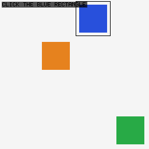
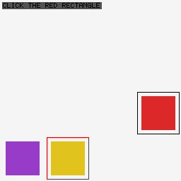
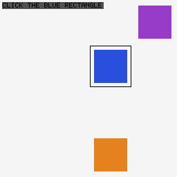
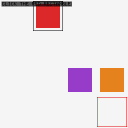

<!-- SPDX-License-Identifier: CC-BY-4.0 -->
<!-- Copyright (c) 2026 Martin Schröder <info@swedishembedded.com> -->

# visualclick - a decision model that answers questions about a picture

Give this model a picture and a plain-language question about it - "click
the blue rectangle" - and it picks the right answer, without ever being
shown a text description of what is in the picture. It reads the image
directly: the same decision head that already answers questions from text
is fed rows built from the picture instead, through a small trainable
adapter, and it answers from those.

## See it work

Each example below is a real run: the picture and instruction on the left
are the actual input, the answer on the right is what the model actually
returned - no text description of the scene was given for any of these.

**"click the blue rectangle"**



Input: the picture above, only. Question: *click the blue rectangle.*
Answer: **cell 2 (row 0, col 2) - correct**, 17% confidence.

**"click the red rectangle"**



Input: the picture above, only. Question: *click the red rectangle.*
Answer: **cell 13 (row 3, col 1) - wrong**, 65% confidence. The black box is
the correct rectangle; the model picked the red-outlined one instead - a
real, honestly-reported miss, not a cherry-picked success.

**"click the blue rectangle" (given as text instead of a picture)**



Input: `blue rectangle at cell 6. orange rectangle at cell 14. purple
rectangle at cell 3.` (no picture). Question: *click the blue rectangle.*
Answer: **cell 6 (row 1, col 2) - correct**, 22% confidence. Shown for
comparison - this is the same model answering from a text description
instead of a picture.

**"click the red rectangle" (given neither a picture nor a description)**



Input: nothing - no picture, no description. Question: *click the red
rectangle.* Answer: **cell 15 - wrong**, 6% confidence, the same guess
every time regardless of the question. This is the control: with no
evidence at all, the model cannot do better than a fixed guess, which is
exactly what should happen.

## How good is it?

400 fresh scenes it was never trained on, chance = 1 in 16 (6.25%):

| given | accuracy |
|---|---|
| a picture | **27.3%** |
| a text description | 27.0% |
| nothing (control) | 5.0% |

Reading a picture does as well as reading a text description of the same
scene, and both are more than 4x chance. Given nothing, it is at chance,
as it should be - proof the model is not somehow guessing the answer from
the question alone.

## Try it yourself

```bash
brain pull sentence-transformers/all-MiniLM-L6-v2

make samples/learning/visualclick/run ARGS="--arm pixels --examples out/examples"
```

That trains on pictures, evaluates on 400 held-out scenes, and saves a few
example images with the model's own answer outlined - like the ones above
- to `out/examples/`. Swap `--arm pixels` for `--arm text` or `--arm blind`
to see the same scenes answered from a description or from nothing. The
first run trains (a few minutes for `text`/`blind`, longer for `pixels`);
every run after that reuses the trained weights instantly unless you pass
`--retrain`. `--shot DIR` alone renders scenes with no model involved, if
you just want to look at the world it is answering questions about.

## What this does and does not show

- The picture is a simple synthetic scene (three solid-colored rectangles
  on a plain grid), not a real photo or screenshot.
- The model was trained on this exact kind of scene; it has not been
  tested on scenes it was never shown pictures like at all.
- The answer is which of 16 grid cells to click, not a pixel-precise
  point.
- The full technical story - how the picture is turned into something the
  decision head can read, and two designs that looked right and were not
  before this one worked - is in this sample's own source code
  (`src/main.rs`, `src/patches.rs`), next to the mechanism it explains.

---

Swedish Embedded AB builds decision systems that answer from whatever
evidence actually bears on the question - a picture, a document, a live
signal - and reports real measured accuracy rather than a demo that only
shows the happy path. If your team needs a decision layer like this in
production, you can procure our services by sending an email to
info@swedishembedded.com.
