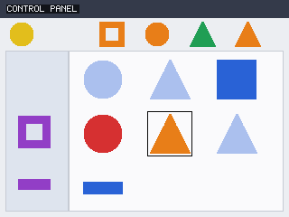
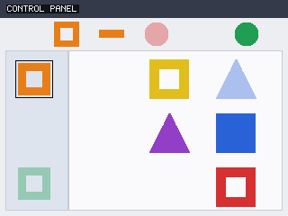
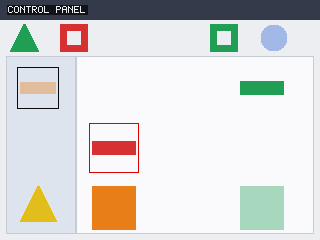

<!-- SPDX-License-Identifier: CC-BY-4.0 -->
<!-- Copyright (c) 2026 Martin Schröder <info@swedishembedded.com> -->

# visualclick - click the thing I asked for

Show this model a screen and tell it what to click, in plain language. It
returns the control to click and the pixel to click it at.

```text
"click the yellow square"              ->  (114, 148)   correct, p=1.000
"click the orange ring in the sidebar" ->  (38, 88)     correct, p=1.000
"click the green disc"                 ->  (174, 38)    correct, p=0.999
```

**96.0% correct on screens it has never seen**, choosing from every control
actually on the screen - nearly thirteen of them on average, so chance is 7.8%.
The click lands a mean of **6.1 pixels** from the centre of the right control.
One decision takes **10.2 ms**, which is 98 screens a second on one GPU.

It reads the screen. Not a description of the screen, not the list of controls
that was used to draw it - the rendered pixels, the same bytes that go into the
PNGs below.

## The task

Each screen is an interface: a toolbar across the top, a sidebar down the left,
a main panel. Ten to sixteen controls are placed on it, each a coloured shape
in one of two states. The instruction names exactly one of them, and the model
has to say which.



Three things an instruction can turn on, and each demands something different:

| instruction | what the model has to do |
|---|---|
| `click the red square` | bind TWO attributes at once - the screen holds red things that are not squares, and squares that are not red |
| `click the dimmed red square` | a third attribute, and it is only ever used when the colour and shape alone are ambiguous, so the state word always decides the answer |
| `click the red square in the sidebar` | work out which AREA of the interface a control is in |

The options are the controls on the screen in front of it - a different set
every frame, in a different arrangement. Nothing about the option list is fixed
at training time, which is the decision surface's own premise: the options
arrive at run time and are scored by what they mean. Here, what they mean is
what they look like.

## What it gets right

500 held-out screens, none of them seen in training:

| | accuracy |
|---|---|
| **overall** | **96.0%** |
| by attribute (`the red square`) | 96.5% |
| by state (`the dimmed red square`) | 96.7% |
| by area (`the red square in the sidebar`) | 93.8% |
| &nbsp;&nbsp;in the sidebar | 100.0% |
| &nbsp;&nbsp;in the main panel | 93.9% |
| &nbsp;&nbsp;in the toolbar | 90.7% |

Chance is 7.8%. Alongside the answer it reports a calibrated confidence -
**ECE 0.014**, so when it says 90% it is right about 90% of the time, which is
what lets a caller route the uncertain cases to a human instead of taking every
answer at face value.

### Seeing it work

`--examples` writes the held-out screens with the correct control outlined in
black, and the model's own answer in red wherever the two differ.



*`click the orange ring in the sidebar`, answered at p=1.000. There is an
orange ring in the TOOLBAR as well; the area phrase is the only thing that
separates them, and the model outlines the sidebar one.*



*One of the one-in-twenty it misses, shown rather than hidden. Black is the
right answer - a DIMMED orange bar in the sidebar, blended so far toward its
background that it reads as pale peach - and red is the bar it chose instead.
Nearly every remaining error looks like this one: a dimmed control whose colour
the blend has pulled close to another's.*

### The answer comes from the screen

Two controls, run on the trained model, each breaking one input and nothing
else. Both have to collapse, or the accuracy above is not measuring what it
claims to:

| what is broken | accuracy |
|---|---|
| nothing | **96.0%** |
| the pixels come from a different screen | 8.8% |
| the instruction is a different screen's | 8.6% |

Both land on chance (7.8%), and both had the full 20 000 training steps to make
the best of the input they were left with. The model is reading the image, and
it is reading the instruction, and neither on its own is enough.

## Run it

```bash
brain pull sentence-transformers/all-MiniLM-L6-v2

make samples/learning/visualclick/run ARGS="--examples out/examples"
```

The first run trains and saves its weights; every run after that loads them and
answers immediately, unless you pass `--retrain`.

```bash
# look at the world first, no model involved
make samples/learning/visualclick/run ARGS="--shot out/screens"

# check the whole data path end to end, before trusting any number
make samples/learning/visualclick/run ARGS="--validate"

# the two controls
make samples/learning/visualclick/run ARGS="--ablate pixels"
make samples/learning/visualclick/run ARGS="--ablate instruction"
```

## Why the numbers are trustworthy

Every claim this result rests on is checked by `--validate`, on the spot,
rather than asked for on faith:

```text
  [pass] oracle - 0/200 screens had an under-qualified instruction
  [pass] pixels carry the answer - 0/19 target crops disagreed with what was drawn
  [pass] row layout - 10 control + 10 slot rows of 384, rms 1.08-2.44
  [pass] gradient seam - worst relative error 0.0000 over 12 probes (in a state row)
  [pass] both halves learn - state |g| 2.688e-6, slot |g| 3.383e-4
      colour     cosine 0.8510
      shape      cosine 0.7685
      region     cosine 0.9091
  [pass] the instruction is separable - closest pair is region at cosine 0.9091
  [pass] no stale gradient - repeating a step moved the gradient by 0.000000
```

- **The oracle cannot be wrong.** Referring expressions are not generated from
  the target and hoped to be unique. Every expression the screen admits is
  enumerated, matched back against every control, and only those matching
  exactly one survive. A screen that admits none is regenerated rather than
  labelled ambiguously. There is no labelling step to get wrong, and no example
  where two answers are equally defensible.
- **The model reads pixels.** `vision::widget_features` pools the canvas the
  PNG is written from. A test re-derives the target's colour from its crop and
  compares it against what was drawn, so no future edit can quietly start
  feeding the model the scene description instead of the screen.
- **The gradient is the gradient.** The rows this sample splices into the
  decision head come back with a gradient, and a finite-difference check
  against the actual loss confirms it is the right one.
- **Every trained part is gradient-checked.** Each projection's analytic
  gradient is checked against a central difference of the same loss, in the
  sample's own unit tests.
- **The words the answer turns on survive the encoder.** A distinction the
  frozen encoder has collapsed cannot be recovered by anything downstream, so
  the colour, shape and area phrases are each measured against a sentence
  differing in that word alone. This check is in the list because the sample
  has been bitten by exactly that, twice.
- **The controls collapse.** Break the pixels or break the instruction and the
  score falls to chance, as shown above.

## How it works

```text
screen pixels ──► per-control crop ──┬──► state rows  ─┐
                  + its box          │                 ├─► decide head ──► one score
"click the red square in the sidebar"┴──► slot rows  ──┘      per control
        (one frozen encoder pass)
```

A frozen 22M-parameter sentence encoder reads the instruction **once per
decision**, not once per option. Everything trained here is a small adapter on
top - 466k parameters - plus the decision head. Adding a control to the screen
costs a matrix-vector product, not another pass through a transformer, which is
where the 10.2 ms comes from.

The part that makes it work is that **both sides of the head's cross-attention
are learned**, and that a control's appearance and its position get their own
projections rather than sharing one. `src/project.rs` documents the
measurements behind each of those choices - including the one that shows why a
frozen sentence encoder's output cannot be used as an option query directly,
and what it costs when a conditioning scale is left free to grow.

## Limitations

- The screens are rendered by this sample, not captured from real software. The
  controls are coloured shapes on flat panels; a screenshot of a real
  application has text, gradients, overlapping widgets and antialiasing that
  this does not.
- The candidate boxes are given, as a detector or an accessibility tree would
  supply them in a real deployment. The model decides **which** control the
  instruction means; it does not find the controls.
- Areas are named regions of the interface with their own backgrounds. A purely
  geometric reference (`the leftmost red square`) is a different and harder
  question - it is a comparison across the options rather than a property of
  one - and `src/screen.rs` records what that measured.

## Cost

It names two surfaces: `decision` to score the controls, and `viewport` to
render the screens - which here is an INPUT path and not only a way to write
the PNGs above, because the features are pooled back off the canvas the
renderer produced. Dropping the rendering would drop the second surface and
the task with it. Beside the frozen encoder, which is the only large thing
loaded, everything this sample trains is 466k parameters. The linked-crate
budget is enforced from `Cargo.toml`, which is where to read it - a count
copied into prose drifts silently as the workspace grows.

---

Swedish Embedded AB builds decision systems that ground an answer in whatever
evidence actually bears on it - a screen, a document, a live signal - and that
report a calibrated confidence alongside it, so the uncertain cases can be
routed rather than guessed. If your team needs a grounded decision layer taken
to production, you can procure our services by sending an email to
info@swedishembedded.com.
